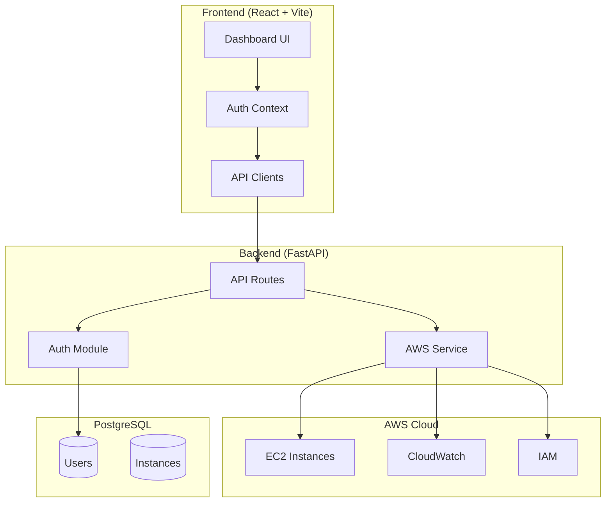

# CloudSim Architecture

## System Overview



## Component Details

### Frontend (`/frontend/src/`)
| Component | File | Purpose |
|-----------|------|---------|
| Dashboard | `components/DashboardPage.tsx` | Main instance list + metrics |
| Login | `components/LoginModal.tsx` | Auth with tester/product modes |
| IAM Panel | `components/IAMPanel.tsx` | User management + settings |
| Auth API | `api/auth.ts` | JWT token management |
| EC2 API | `api/ec2.ts` | Instance + metrics operations |

### Backend (`/backend/app/`)
| Module | File | Purpose |
|--------|------|---------|
| Auth | `auth.py`, `auth_routes.py` | JWT + OAuth2 password flow |
| Admin | `admin_routes.py` | User CRUD (Admin only) |
| EC2 | `ec2_routes.py` | Instance management API |
| AWS | `aws_service.py` | Boto3 EC2 + CloudWatch |
| Models | `models.py` | User + Instance SQLAlchemy |

## API Endpoints

### Authentication
```
POST /api/auth/register    - Create account
POST /api/auth/login       - Get JWT token
GET  /api/auth/me          - Current user info
```

### Admin (requires Admin role)
```
GET    /api/admin/users           - List users
POST   /api/admin/users           - Create user with role
DELETE /api/admin/users/{id}      - Delete user
```

### EC2 (requires auth)
```
GET    /api/ec2/instances              - List instances
POST   /api/ec2/instances              - Create instance
POST   /api/ec2/instances/{id}/start   - Start instance
POST   /api/ec2/instances/{id}/stop    - Stop instance
DELETE /api/ec2/instances/{id}         - Terminate (Admin)
GET    /api/ec2/instances/{id}/metrics - CloudWatch metrics
```

## Tech Stack

| Layer | Technology |
|-------|------------|
| Frontend | React 18, Vite, TailwindCSS, Shadcn UI |
| Backend | FastAPI, Pydantic, SQLAlchemy |
| Auth | JWT (python-jose), bcrypt (passlib) |
| Cloud | AWS SDK (boto3) - EC2, CloudWatch |
| Database | PostgreSQL |

## Security

- **JWT tokens** with 30-min expiration
- **bcrypt** password hashing (never plain text)
- **Role-based access**: Admin, Developer, DevOps Engineer, User
- **CORS** configured for localhost development
