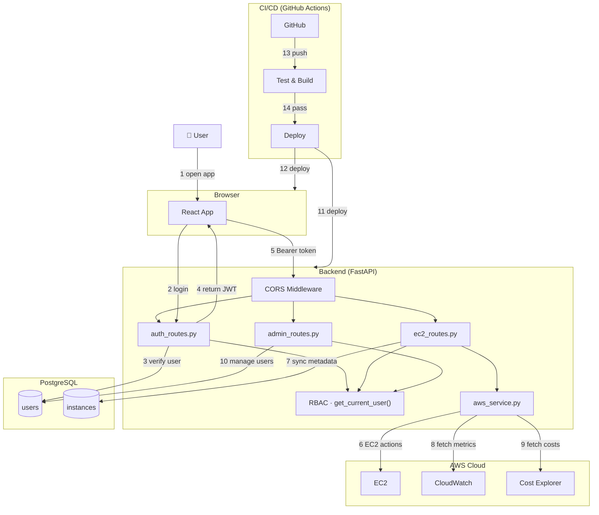

# CloudSim — Reference Architecture Diagram

> Modeled after AWS Reference Architecture style.
> Each numbered callout corresponds to a step in the system flow described in the legend below.

---

## Architecture Diagram

---

## Flow Legend

| # | Actor / Component | Action |
|---|---|---|
| 1 | User → React App | User opens the app in a browser; React loads the Login modal |
| 2 | React App → `auth_routes` | User submits credentials via `POST /api/auth/login` |
| 3 | `auth_routes` → PostgreSQL | Backend looks up `users` table, verifies bcrypt hash |
| 4 | `auth_routes` → React App | On success, a signed JWT (HS256, 30 min TTL) is returned and stored in `localStorage` |
| 5 | React App → CORS Middleware | Every subsequent API call carries `Authorization: Bearer <token>`; CORS middleware validates the origin, RBAC dependency decodes the token and injects the current user |
| 6 | `ec2_routes` → AWS EC2 | Route handlers call `aws_service.py` which wraps boto3 to run `describe_instances`, `run_instances`, `start_instances`, `stop_instances`, `terminate_instances` |
| 7 | `ec2_routes` → PostgreSQL | After each AWS response, instance metadata is upserted into the local `instances` table via `sync_instances_to_db()` for fast reads and ownership tracking |
| 8 | `ec2_routes` → CloudWatch | `GET /api/ec2/instances/{id}/metrics` calls `get_metric_statistics()` for CPU, NetworkIn/Out, DiskReadOps, DiskWriteOps |
| 9 | `ec2_routes` → Cost Explorer | `GET /api/ec2/costs/daily` and `/costs/summary` call the Cost Explorer API for daily spend and monthly projections |
| 10 | `admin_routes` → PostgreSQL | Admin-only routes create, deactivate, and list users directly against the `users` table; guarded by `require_admin()` dependency |
| 11 | GitHub Actions → Backend | On push to `main`, CI pipeline runs pytest, then deploys updated backend to Render |
| 12 | GitHub Actions → Frontend | Same pipeline runs `npm run build`, then deploys static frontend to Vercel |
| 13 | Developer → GitHub | Developer pushes code or opens a PR; CodeBuild stage triggers |
| 14 | GitHub Actions | pytest + npm build both pass before deploy stage runs |

---

## Component Responsibilities

| Component | Technology | Responsibility |
|---|---|---|
| React App | React 18 · TypeScript · Vite | UI, routing, API client (Axios), auth state (UserContext) |
| CORS Middleware | FastAPI `CORSMiddleware` | Restrict cross-origin requests to `localhost:5173` and production domain |
| RBAC Dependency | `get_current_user()` in `auth.py` | Decode JWT, load user from DB, enforce role checks on every protected route |
| `auth_routes` | FastAPI router | Register, login, token issuance, `/me` endpoint |
| `ec2_routes` | FastAPI router | Full EC2 lifecycle, metrics, cost endpoints with ownership filtering |
| `admin_routes` | FastAPI router | User management — Admin role required |
| `aws_service.py` | boto3 | Abstraction layer over EC2, CloudWatch, Cost Explorer APIs |
| PostgreSQL | SQLAlchemy ORM | Persist users (auth/RBAC) and synced EC2 metadata |
| GitHub Actions | CI/CD pipeline | Lint → Test → Build → Deploy on every push to `main` |

---

*Document Version: 1.0 | Created: March 2026*
