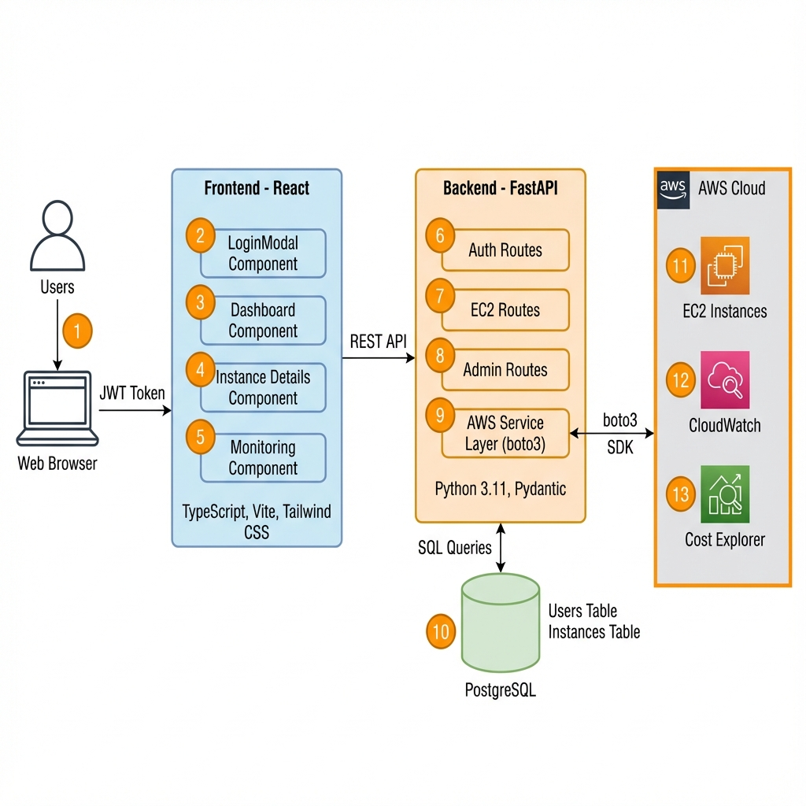
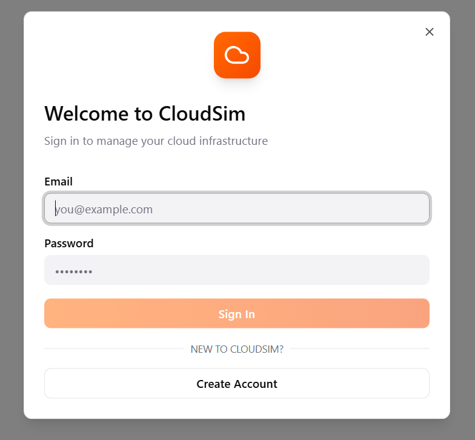

# CloudSim — System Architecture

**A cloud infrastructure management application that integrates with AWS EC2 for real-time instance management, monitoring, and cost tracking.**

This document provides a comprehensive architectural overview of CloudSim, showing how the frontend, backend, database, and AWS services interact to deliver a complete cloud management experience.

---

## Architecture Diagram



*Figure: High-level system architecture showing the flow from user interaction through the frontend (React), backend (FastAPI), database (PostgreSQL), and AWS services (EC2, CloudWatch, Cost Explorer).*

---

## Component Walkthrough

The numbered sections below correspond to the callouts in the architecture diagram above.

---

### 1️⃣ User Authentication (Login)



Users authenticate through the **LoginModal** component by entering credentials (email/password) or selecting a tester role. The frontend sends a `POST /api/auth/login` request to the backend.

**Key Components:**
- `frontend/src/components/LoginModal.tsx` — UI for authentication
- `frontend/src/api/auth.ts` — API client for auth endpoints
- `backend/app/auth_routes.py` — Login endpoint

**Flow:**
1. User enters email and password
2. Frontend calls `POST /api/auth/login`
3. Backend validates credentials against PostgreSQL
4. On success, JWT token returned to frontend
5. Token stored in localStorage for subsequent requests

---

### 2️⃣ JWT Token Management

> 📌 **[Image Placeholder: JWT Token Lifecycle]**

The application uses **JSON Web Tokens (JWT)** for stateless authentication. Tokens are generated using the `python-jose` library with HS256 algorithm and 30-minute expiration.

**Key Components:**
- `backend/app/auth.py` — Token creation and validation
- `frontend/src/contexts/UserContext.tsx` — Token storage and auto-refresh

**Security Features:**
- Tokens expire after 30 minutes
- Passwords hashed with **bcrypt** (never stored in plain text)
- `Authorization: Bearer <token>` header required for all protected routes

---

### 3️⃣ Frontend Application (React)


The frontend is a **React 18 + TypeScript** single-page application built with Vite. It uses **shadcn/ui** components and **Tailwind CSS** for styling.

**Directory Structure:**
```
frontend/src/
├── App.tsx                    # Root component with tab navigation
├── api/                       # API client layer (Axios)
│   ├── client.ts              # Axios instance configuration
│   ├── auth.ts                # Authentication API
│   └── ec2.ts                 # EC2 operations API
├── components/                # UI Components
│   ├── DashboardPage.tsx      # Main instance list view
│   ├── InstanceDetailsPage.tsx # Detailed instance view
│   └── InstanceMonitoringPage.tsx # Metrics and costs
└── contexts/
    └── UserContext.tsx        # Global auth state
```

**Key Technologies:**
| Technology | Purpose |
|------------|---------|
| React 18 | UI framework |
| TypeScript | Type safety |
| Tailwind CSS | Utility-first styling |
| shadcn/ui | Component library |
| Axios | HTTP client |
| Recharts | Data visualization |

---

### 4️⃣ API Client Layer (Axios)

> 📌 **[Image Placeholder: API Request Flow]**

The frontend uses **Axios** to communicate with the FastAPI backend. A centralized client instance handles base URL configuration and headers.

**Key Components:**
- `frontend/src/api/client.ts` — Axios instance
- `frontend/src/api/ec2.ts` — EC2 API functions

**Example Request Flow:**
```typescript
// frontend/src/api/ec2.ts
export async function getInstance(instanceId: string): Promise<EC2InstanceDetails> {
    const response = await api.get<EC2InstanceDetails>(`/api/ec2/instances/${instanceId}`);
    return response.data;
}
```

---

### 5️⃣ Backend API (FastAPI)

> 📌 **[Image Placeholder: FastAPI Route Structure]**

The backend is built with **FastAPI**, a modern Python web framework with automatic OpenAPI documentation. It handles authentication, EC2 operations, and database interactions.

**Directory Structure:**
```
backend/app/
├── main.py            # FastAPI app, CORS, router inclusion
├── auth.py            # JWT utilities, password hashing
├── auth_routes.py     # /api/auth/* endpoints
├── admin_routes.py    # /api/admin/* endpoints
├── ec2_routes.py      # /api/ec2/* endpoints
├── aws_service.py     # boto3 wrapper for AWS
├── db.py              # Database connection
└── models.py          # SQLAlchemy models
```

**API Documentation:**
Access interactive docs at:
- **Swagger UI:** `http://localhost:8000/docs`
- **ReDoc:** `http://localhost:8000/redoc`

---

### 6️⃣ CORS Middleware

> 📌 **[Image Placeholder: CORS Request Headers]**

Cross-Origin Resource Sharing (CORS) is configured to allow the frontend (running on port 5173) to communicate with the backend (port 8000).

**Configuration:**
```python
# backend/app/main.py
app.add_middleware(
    CORSMiddleware,
    allow_origins=["http://localhost:5173", "http://localhost:3000"],
    allow_credentials=True,
    allow_methods=["*"],
    allow_headers=["*"],
)
```

---

### 7️⃣ Authentication Module

> 📌 **[Image Placeholder: Auth Flow Sequence Diagram]**

The authentication module handles user registration, login, and JWT validation using FastAPI's dependency injection system.

**Endpoints:**
| Method | Endpoint | Description |
|--------|----------|-------------|
| POST | `/api/auth/register` | Create new account |
| POST | `/api/auth/login` | Get JWT token |
| GET | `/api/auth/me` | Get current user info |

**Key Functions:**
- `get_password_hash(password)` — Hash password with bcrypt
- `verify_password(plain, hashed)` — Validate password
- `create_access_token(data)` — Generate JWT
- `get_current_user(token)` — Dependency for protected routes

---

### 8️⃣ Role-Based Access Control (RBAC)

> 📌 **[Image Placeholder: Role Permissions Matrix]**

CloudSim implements role-based access control with three roles:

| Role | Permissions |
|------|-------------|
| **User** | Manage (start/stop/reboot/terminate) own instances, view own metrics |
| **DevOps Engineer** | Full EC2 + CloudWatch + Cost Explorer |
| **Admin** | All permissions + manage users, modify quotas |

**Implementation:**
```python
# backend/app/ec2_routes.py
@router.delete("/instances/{instance_id}")
async def terminate_instance(instance_id: str, current_user: User = Depends(get_current_user)):
    # Backend verifies role and instance ownership before calling AWS
    return aws_service.terminate_instance(instance_id)
```

---

### 9️⃣ PostgreSQL Database

> 📌 **[Image Placeholder: Database Schema Diagram]**

CloudSim uses **PostgreSQL** for persistent storage of users and synced instance data. SQLAlchemy ORM handles all database interactions.

**Database Schema:**

**Users Table:**
| Column | Type | Description |
|--------|------|-------------|
| id | INTEGER | Primary key |
| email | VARCHAR | Unique email |
| hashed_password | VARCHAR | bcrypt hash |
| role | VARCHAR | User role |
| is_active | BOOLEAN | Account status |
| created_at | DATETIME | Creation timestamp |

**Instances Table:**
| Column | Type | Description |
|--------|------|-------------|
| instance_id | VARCHAR | AWS instance ID (PK) |
| name | VARCHAR | Name tag |
| instance_type | VARCHAR | e.g., t2.micro |
| state | VARCHAR | running, stopped, etc. |
| public_ip | VARCHAR | Public IP address |
| private_ip | VARCHAR | Private IP address |
| availability_zone | VARCHAR | AWS AZ |
| last_synced | DATETIME | Last sync time |

---

### 🔟 AWS Service Layer (boto3)

> 📌 **[Image Placeholder: AWS Service Integration Diagram]**

The `aws_service.py` module provides a clean abstraction over **boto3** for EC2, CloudWatch, and Cost Explorer operations.

**Key Functions:**
```python
# backend/app/aws_service.py

# EC2 Operations
list_instances() -> list[dict]
get_instance(instance_id) -> dict
create_instance(name, instance_type) -> dict
start_instance(instance_id) -> dict
stop_instance(instance_id) -> dict
terminate_instance(instance_id) -> dict

# CloudWatch Metrics
get_instance_metrics(instance_id, period_minutes) -> dict
get_instance_current_metrics(instance_id) -> dict

# Cost Explorer
get_daily_costs(days) -> list[dict]
get_monthly_summary() -> dict
```

---

### 1️⃣1️⃣ AWS EC2 Integration

> 📌 **[Image Placeholder: EC2 Instance Lifecycle]**

CloudSim connects to **AWS EC2** using the boto3 SDK. It can list, create, start, stop, reboot, and terminate instances.

**Credentials Configuration:**
- Uses `~/.aws/credentials` (configured via `aws configure`)
- Region set via `AWS_REGION` environment variable (default: us-east-1)

**Instance Creation Flow:**
1. User submits form with name and instance type
2. Backend calls `ec2_resource.create_instances()`
3. AWS returns instance with `pending` state
4. Instance synced to local database
5. Dashboard refreshes to show new instance

---

### 1️⃣2️⃣ AWS CloudWatch Integration

> 📌 **[Image Placeholder: CloudWatch Metrics Dashboard]**

CloudSim retrieves real-time metrics from **AWS CloudWatch** for monitoring CPU, network, and disk performance.

**Available Metrics:**
| Metric | Description | Unit |
|--------|-------------|------|
| CPUUtilization | CPU usage percentage | Percent |
| NetworkIn | Incoming network traffic | Bytes |
| NetworkOut | Outgoing network traffic | Bytes |
| DiskReadOps | Disk read operations | Count |
| DiskWriteOps | Disk write operations | Count |

**API Endpoint:** `GET /api/ec2/instances/{id}/metrics?period=60`

---

### 1️⃣3️⃣ AWS Cost Explorer Integration

> 📌 **[Image Placeholder: Cost Breakdown Chart]**

CloudSim integrates with **AWS Cost Explorer** to provide cost tracking and projections. *(Note: Currently using mock data to avoid API costs)*

**Endpoints:**
| Endpoint | Description |
|----------|-------------|
| `GET /api/ec2/costs/daily` | Daily cost breakdown |
| `GET /api/ec2/costs/summary` | Month-to-date and projected costs |

---

### 1️⃣4️⃣ Instance Sync to Database

> 📌 **[Image Placeholder: Data Sync Flow]**

When the frontend requests instance data, the backend fetches from AWS and syncs to PostgreSQL for persistence and fast queries.

**Sync Process:**
1. `GET /api/ec2/instances` triggers AWS API call
2. `aws_service.list_instances()` fetches from EC2
3. `sync_instances_to_db()` upserts to PostgreSQL
4. Response returned to frontend

**Benefits:**
- Faster subsequent queries (local DB)
- Historical tracking
- Works offline (cached data)

---

### 1️⃣5️⃣ Dashboard Page

> 📌 **[Image Placeholder: Dashboard Screenshot]**

The main dashboard displays all EC2 instances with real-time status, action buttons, and quick metrics.

**Features:**
- Instance table with name, ID, type, state, IPs
- Action buttons: Start, Stop, Reboot, Terminate
- Zone health indicators
- Alarm status panel

**Component:** `frontend/src/components/DashboardPage.tsx`

---

### 1️⃣6️⃣ Instance Details Page

> 📌 **[Image Placeholder: Instance Details Screenshot]**

Clicking an instance navigates to a detailed view with comprehensive EC2 metadata.

**Tabs:**
| Tab | Information |
|-----|-------------|
| Details | Instance ID, type, AMI, launch time, monitoring |
| Security | Security groups, IAM role |
| Networking | VPC, Subnet, DNS names, IPs |
| Storage | EBS volumes with size, type, encryption |
| Tags | All instance tags |

**Component:** `frontend/src/components/InstanceDetailsPage.tsx`

---

### 1️⃣7️⃣ Monitoring Page

> 📌 **[Image Placeholder: Monitoring Charts]**

The monitoring page displays CloudWatch metrics as interactive charts and cost breakdowns.

**Features:**
- CPU utilization line chart
- Network In/Out charts
- Daily cost breakdown bar chart
- Monthly cost projection

**Component:** `frontend/src/components/InstanceMonitoringPage.tsx`

---

## Data Flow Summary

> 📌 **[Image Placeholder: Complete Data Flow Diagram]**

```
┌──────────────────────────────────────────────────────────────────────────────┐
│                              USER INTERACTION                                  │
└──────────────────────────────────────────────────────────────────────────────┘
                                      │
                                      ▼
┌──────────────────────────────────────────────────────────────────────────────┐
│                         FRONTEND (React + TypeScript)                         │
│  ┌─────────────┐  ┌─────────────┐  ┌─────────────┐  ┌─────────────┐         │
│  │  Dashboard  │  │  Details    │  │ Monitoring  │  │   Login     │         │
│  └──────┬──────┘  └──────┬──────┘  └──────┬──────┘  └──────┬──────┘         │
│         └─────────────────┴───────────────┴─────────────────┘                │
│                                   │                                           │
│                          API Client (Axios)                                   │
└──────────────────────────────────┬───────────────────────────────────────────┘
                                   │ HTTP/REST
                                   ▼
┌──────────────────────────────────────────────────────────────────────────────┐
│                          BACKEND (FastAPI + Python)                           │
│  ┌─────────────┐  ┌─────────────┐  ┌─────────────┐  ┌─────────────┐         │
│  │ Auth Routes │  │ EC2 Routes  │  │Admin Routes │  │   CORS      │         │
│  └──────┬──────┘  └──────┬──────┘  └──────┬──────┘  └─────────────┘         │
│         │                │                │                                   │
│         ▼                ▼                ▼                                   │
│  ┌─────────────────────────────────────────────────┐                         │
│  │              AWS Service Layer (boto3)           │                         │
│  └──────────────────────┬──────────────────────────┘                         │
└─────────────────────────┼────────────────────────────────────────────────────┘
                          │
          ┌───────────────┼───────────────┐
          ▼               ▼               ▼
   ┌─────────────┐ ┌─────────────┐ ┌─────────────┐
   │  PostgreSQL │ │   AWS EC2   │ │ CloudWatch  │
   │  (Users,    │ │ (Instances) │ │  (Metrics)  │
   │  Instances) │ │             │ │             │
   └─────────────┘ └─────────────┘ └─────────────┘
```

---

## Technology Stack Summary

| Layer | Technology | Purpose |
|-------|------------|---------|
| **Frontend** | React 18, TypeScript, Vite | UI framework |
| **Styling** | Tailwind CSS, shadcn/ui | Component styling |
| **Charts** | Recharts | Data visualization |
| **HTTP Client** | Axios | API requests |
| **Backend** | FastAPI, Python 3.11+ | Web framework |
| **Validation** | Pydantic | Request/response schemas |
| **ORM** | SQLAlchemy 2.0 | Database access |
| **Database** | PostgreSQL | Persistent storage |
| **Auth** | python-jose (JWT), passlib (bcrypt) | Authentication |
| **AWS SDK** | boto3 | EC2, CloudWatch, Cost Explorer |
| **Dev Server** | Uvicorn | ASGI server |

---

## Security Architecture

> 📌 **[Image Placeholder: Security Flow Diagram]**

| Security Layer | Implementation |
|----------------|----------------|
| **Authentication** | JWT tokens with 30-min expiration |
| **Password Storage** | bcrypt hashing (never plain text) |
| **Authorization** | Role-based access control (RBAC) |
| **API Security** | Bearer token required on all protected routes |
| **CORS** | Restricted to allowed frontend origins |
| **AWS Credentials** | Environment variables / AWS credentials file |

---

## Deployment Architecture

> 📌 **[Image Placeholder: Deployment Diagram]**

**Development:**
```bash
# Frontend (Terminal 1)
cd frontend && npm run dev    # http://localhost:5173

# Backend (Terminal 2)
cd backend && uvicorn app.main:app --reload    # http://localhost:8000
```

**Production (Suggested):**
| Component | Platform |
|-----------|----------|
| Frontend | Vercel / Netlify |
| Backend | Railway / Render |
| Database | Railway Postgres / AWS RDS |

---

*Document Version: 1.0 | Last Updated: January 2026*
