# CloudSim — User Journey Walkthrough

## 1. Purpose and Scope

This document provides a **complete architectural walkthrough of CloudSim**, following the **actual user journey** from first interaction through cloud execution. It is intended to be read alongside the architecture diagram and serves as a narrative explanation of how system components collaborate at runtime.

## 2. System Context Overview

CloudSim is composed of four primary layers:

- **User Interaction Layer**: (Browser)
- **Frontend Application Layer**:
  - React (UI Framework)
  - TypeScript (Type-safe JavaScript)
  - Axios (HTTP Client for API calls)
  - Vite (Build tool, dev server)
  - Tailwind CSS (Styling)
- **Backend Orchestration Layer**: (FastAPI + PostgreSQL)
- **Infrastructure & Persistence Layer**: (AWS EC2, CloudWatch, Cost Explorer)

The following diagram establishes the architectural context used throughout this walkthrough.

## 3. Entry Point: User Interaction and Frontend Boundary

All CloudSim workflows begin with user interaction in the browser. The frontend operates as a single-page application (SPA) responsible solely for presentation, navigation, and request orchestration. No cloud credentials or business logic are present in this layer.

## 4. Authentication and Session Establishment Flow

Authentication is the first architectural gate. Users submit credentials via the login interface, which are transmitted securely to the backend. The backend validates credentials against the database and issues a signed JWT embedding identity and role claims.

Once issued, the JWT enables stateless communication across the system.

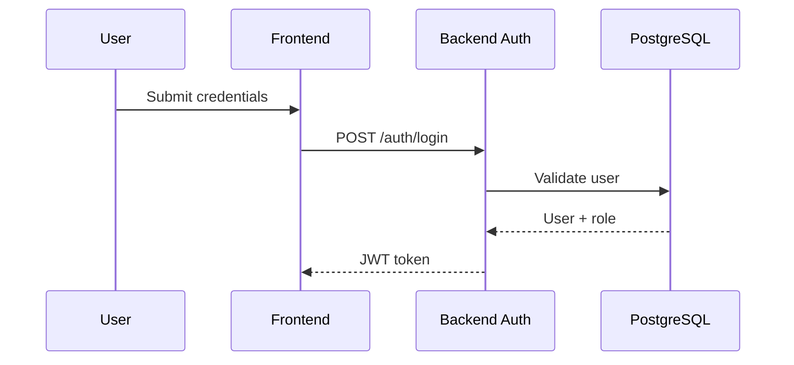

## 5. Dashboard Load Walkthrough

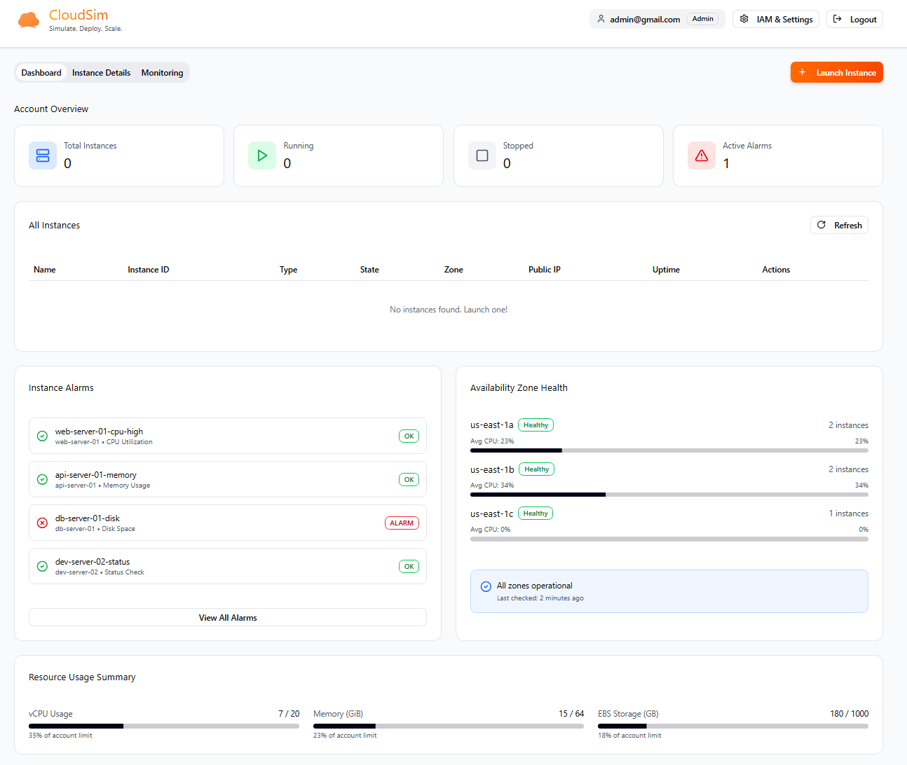

After authentication, the dashboard is the primary landing view. Its purpose is to present a real-time inventory of EC2 instances. The frontend requests instance data without assumptions about infrastructure state.

The backend performs authorization checks and queries AWS directly, ensuring the dashboard reflects live cloud data.

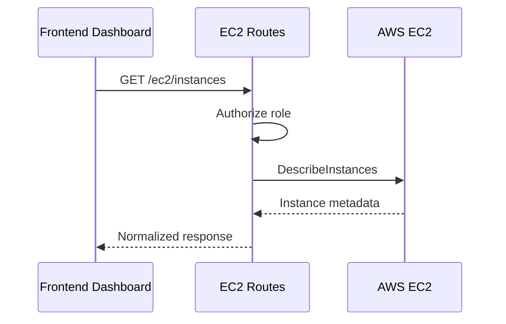

## 6. Instance Lifecycle Operations

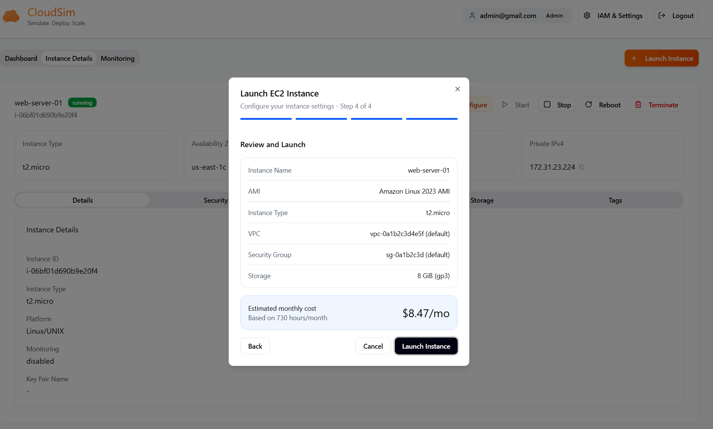

Lifecycle actions (start, stop, reboot, terminate) are initiated by explicit user intent. The frontend sends an intent-based request and immediately relinquishes control. All enforcement and execution occur in the backend and AWS.

Instance state transitions are asynchronous and eventually consistent.

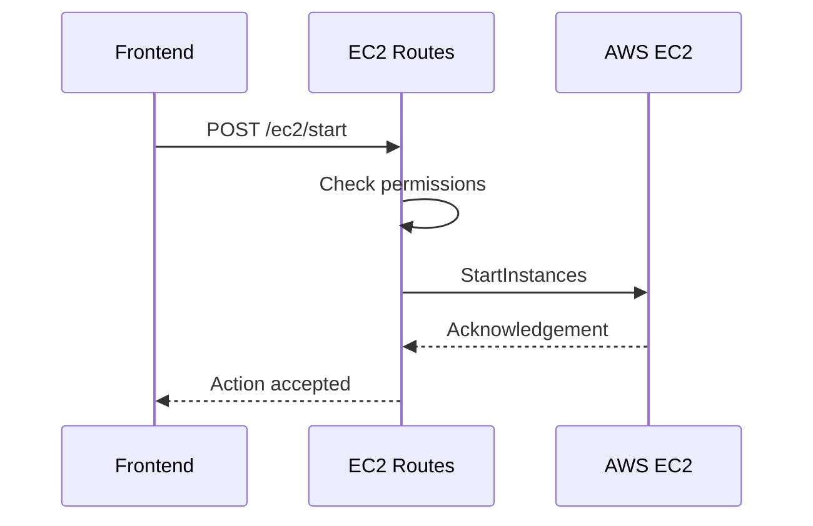

## 7. Instance Details Aggregation Flow

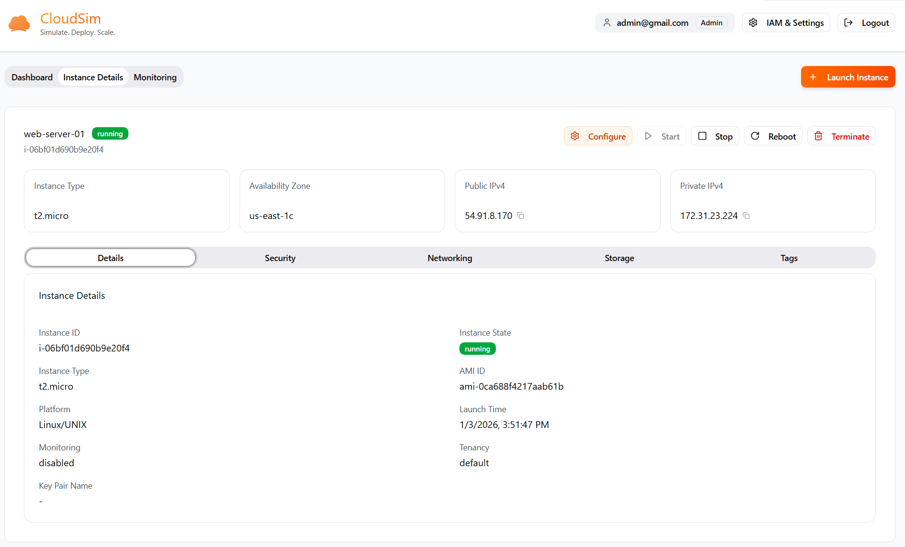

The instance details page requires data from multiple AWS subsystems. Rather than exposing this complexity to the frontend, the backend aggregates and normalizes the data into a single response model.

This design preserves frontend simplicity while maintaining backend control.

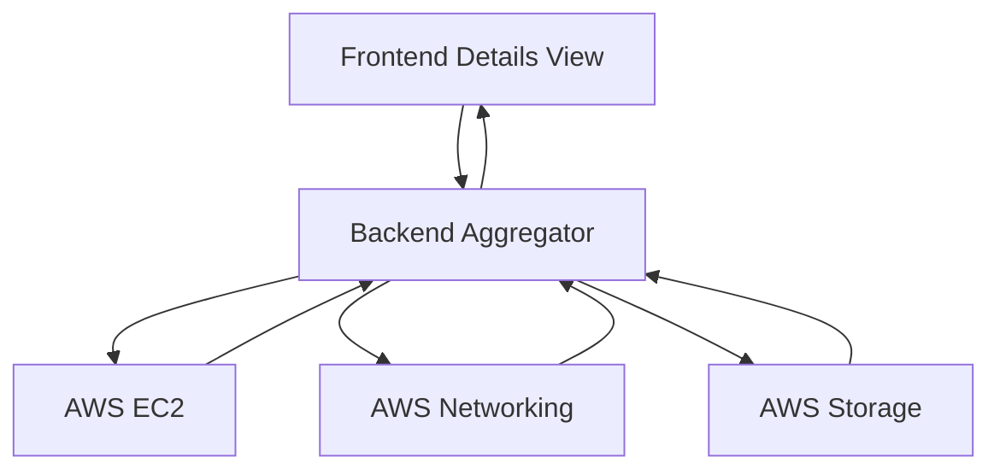

## 8. Monitoring and Metrics Flow

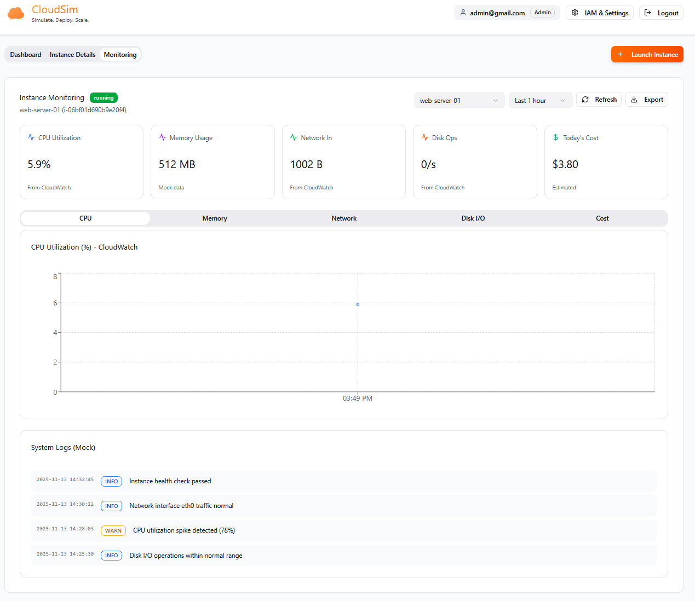

Monitoring workflows allow users to inspect instance performance over time. The frontend specifies the instance and time range, while the backend handles CloudWatch semantics and data shaping.

This separation enables reusable visualization components and consistent metric interpretation.

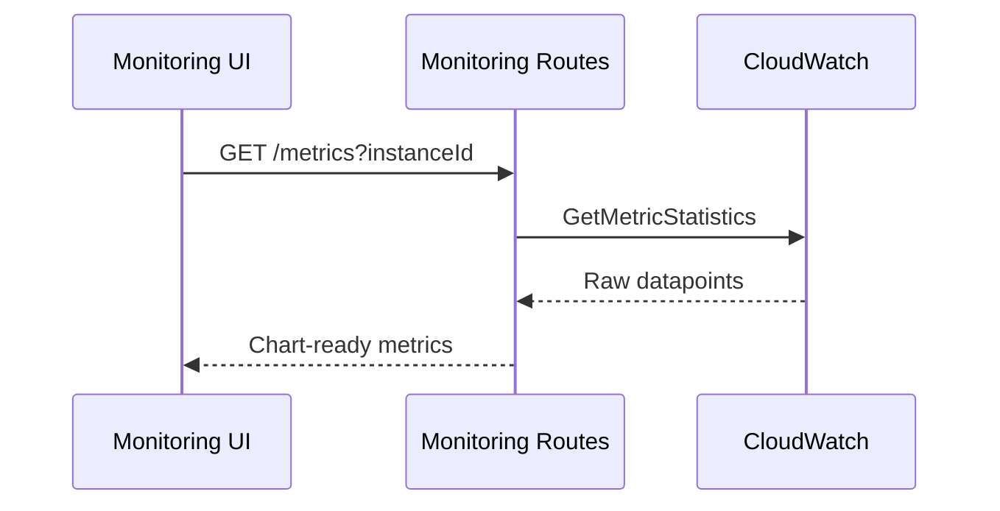

## 9. Administrative Workflow

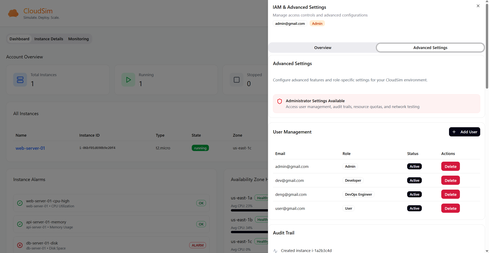
Administrative actions reuse the same architectural pipeline but require elevated role claims. This ensures a consistent execution model while enforcing least-privilege access.

Admin operations may interact with both persistent storage and cloud services.

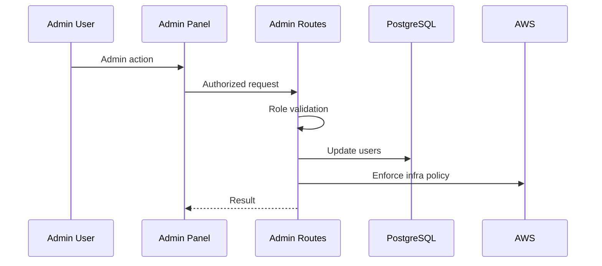

## 10. Error Propagation and Resilience

All errors are handled centrally by the backend. AWS and validation errors are mapped to standardized HTTP responses. The frontend interprets these responses and provides user-friendly feedback without exposing internal system details.

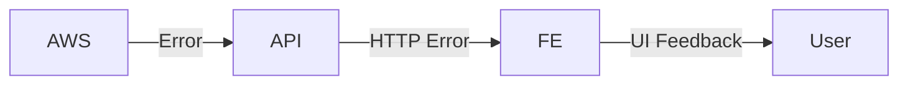

## 11. End-to-End Architectural Summary

From the user’s perspective, CloudSim provides a clean, predictable interface for managing infrastructure. From the system’s perspective, it enforces strict separation of concerns:

- Frontend expresses intent
- Backend enforces policy and orchestration
- AWS executes infrastructure state
