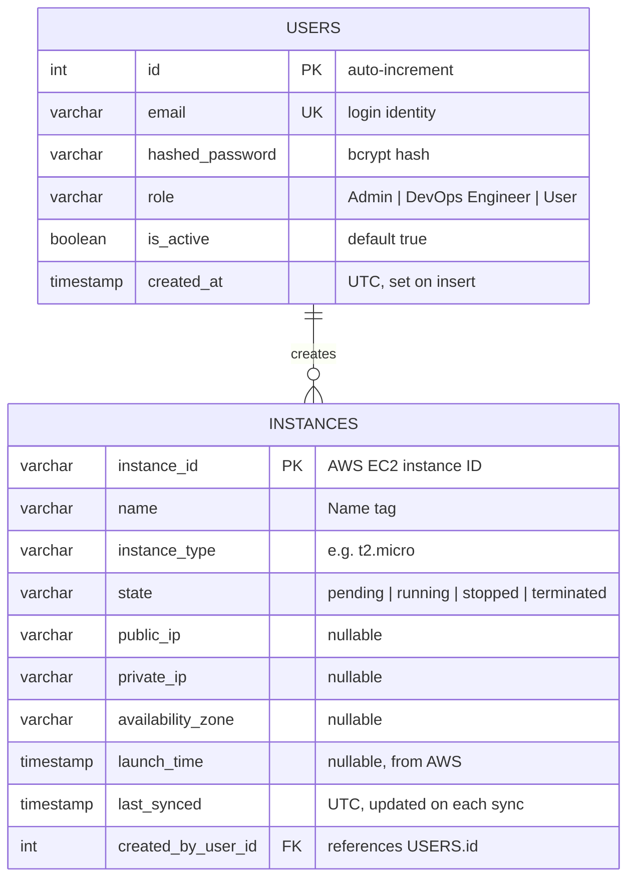

# CloudSim Database Schema

## Entity Relationship Diagram



> **Note:** `created_by_user_id` is enforced at the application layer, not as a database-level foreign key constraint. This is intentional — if a user is deleted, their historical instance records are preserved.

---

## Overview
CloudSim uses PostgreSQL as its primary application database. The database supports three core concerns:

- authentication through locally stored user accounts
- authorization through role values attached to each user
- local tracking of EC2 instance metadata that the application syncs from AWS

The current backend ORM defines two application tables:

- `users`
- `instances`

The backend source of truth is the SQLAlchemy model layer in [backend/app/models.py](/home/tinhc/CloudSim/backend/app/models.py). This document exists as a standalone schema specification so engineers can understand the data model without reverse-engineering the ORM.

## Role Model
CloudSim currently supports three application roles. These roles are stored directly as string values in the `users.role` column. There is no separate `roles` table or permissions matrix table at this stage.

### `Admin`
Admins have full access to the application. They can manage users through the admin API and can perform all EC2 operations.

### `DevOps Engineer`
DevOps Engineers can perform EC2 lifecycle operations and view all instances, but they cannot use the admin user-management endpoints.

### `User`
Users are limited to their own resources. Instance access is filtered by application logic using ownership metadata such as `created_by_user_id` or AWS tagging.

## Table Definitions

### `users`
Purpose: store application accounts used for login, authorization, and admin-controlled user management.

| Column | Type | Nullable | Default | Constraints | Meaning |
| :--- | :--- | :--- | :--- | :--- | :--- |
| `id` | integer | No | auto-increment | Primary key, indexed | Internal user identifier |
| `email` | string / varchar | No | None | Unique, indexed | Login identity and primary lookup field |
| `hashed_password` | string / varchar | No | None | Must store a bcrypt hash | Password digest, never plaintext |
| `role` | string / varchar | No | `User` | Valid values: `Admin`, `DevOps Engineer`, `User` | Authorization level |
| `is_active` | boolean | No | `true` | None | Soft-enable or disable an account |
| `created_at` | datetime / timestamp | No | current UTC time in ORM | None | Account creation time |

Behavior notes:

- `email` is the unique login field used during authentication.
- `hashed_password` is checked during `/api/auth/login`.
- `role` is consulted by both admin routes and EC2 routes to decide access.
- `is_active` allows an account to be disabled without deleting it.

### `instances`
Purpose: store a local representation of EC2 instances so the application can cache AWS metadata and apply user-specific visibility rules.

| Column | Type | Nullable | Default | Constraints | Meaning |
| :--- | :--- | :--- | :--- | :--- | :--- |
| `instance_id` | string / varchar | No | None | Primary key, indexed | AWS EC2 instance ID |
| `name` | string / varchar | Yes | None | None | Name tag or local display name |
| `instance_type` | string / varchar | No | None | None | EC2 instance class such as `t2.micro` |
| `state` | string / varchar | No | `pending` | None | Current lifecycle state |
| `public_ip` | string / varchar | Yes | None | None | Public IPv4 address if assigned |
| `private_ip` | string / varchar | Yes | None | None | Private IPv4 address |
| `availability_zone` | string / varchar | Yes | None | None | AWS availability zone |
| `launch_time` | datetime / timestamp | Yes | None | None | Original EC2 launch timestamp |
| `last_synced` | datetime / timestamp | No | current UTC time in ORM | None | Last application sync from AWS |
| `created_by_user_id` | integer | Yes | None | Application metadata only | CloudSim user associated with creation |

Behavior notes:

- `instance_id` is the durable external identifier, so it is used as the table primary key.
- The table is not meant to replace AWS as the source of truth for infrastructure.
- `created_by_user_id` helps the app decide which `User` accounts can manage an instance.

## Constraints and Rules

### Database-level constraints
- `users.id` is the primary key.
- `users.email` is unique.
- `instances.instance_id` is the primary key.
- `users.role` is constrained to `Admin`, `DevOps Engineer`, or `User` in the PostgreSQL recreation script and ORM check constraint.

### Application rules
- `hashed_password` must always store bcrypt hashes.
- `created_by_user_id` is application-owned metadata and is not currently enforced as a foreign key by the ORM.
- Admin-only behavior is enforced in route dependencies, not through relational permissions.
- Instance visibility and control rules are enforced in application logic, not through row-level security.

## Seed Data
The backend and frontend both assume a default local seed dataset for development and walkthroughs.

| Email | Password | Role | Active |
| :--- | :--- | :--- | :--- |
| `admin@gmail.com` | `admin123` | `Admin` | `true` |
| `devops@gmail.com` | `devops123` | `DevOps Engineer` | `true` |
| `deng@gmail.com` | `deng123` | `DevOps Engineer` | `true` |
| `user@gmail.com` | `user123` | `User` | `true` |

These accounts exist so the login flow, role-based UI states, and admin features can be exercised quickly in local development without manual account creation.

## Detailed Walkthrough
The `users` table exists because CloudSim uses first-party authentication instead of delegating all identity management to AWS or an external identity provider. A user signs in with an email and password. During login, the backend looks up `users.email`, checks the submitted password against `users.hashed_password`, and then issues a JWT. That means this table is the root of the entire auth flow: if the row is missing, inactive, or assigned the wrong role, the rest of the application behaves differently immediately.

The `role` column is the second key part of the design. CloudSim keeps authorization intentionally simple by using a single string column instead of normalized roles and permissions tables. That choice keeps local development and debugging easy. When the current user hits an admin route, the backend checks whether `role == "Admin"`. When the user accesses EC2 endpoints, route logic treats `Admin` and `DevOps Engineer` as broader-access roles and treats `User` as a restricted role. Because the role is embedded directly on the user row, changing one value can immediately change what the frontend and backend permit.

The `instances` table exists for a different reason. CloudSim interacts with AWS, but it still needs a local view of instances so it can display them efficiently and track application-specific ownership metadata. The application stores fields like instance type, state, IPs, launch time, and sync time locally. That gives the frontend a stable contract while the backend refreshes data from AWS as needed.

The most important application-owned field on the `instances` table is `created_by_user_id`. It is not modeled as a foreign key today, but it still matters because the app uses it as part of ownership and visibility decisions. In practice, this lets CloudSim answer questions like “which instances belong to this regular user?” without needing a separate join table or a more complex policy engine.

Just as important is what the schema does not model yet. There is no separate `roles` table, no normalized permissions schema, no audit log tables, no database migration framework in the current code, and no strict foreign-key enforcement between `instances.created_by_user_id` and `users.id`. Those omissions are intentional for now. The current schema favors clarity and development speed over deeper normalization.

## Recreation Workflow
CloudSim now has two recommended recreation paths.

### SQL recreation
Use SQL when you want a direct PostgreSQL reset, especially if you are operating from `psql` or restoring a known development state. The SQL script is the best fit for local DB rebuilds, demos, and manual admin workflows.

Recommended command:

```bash
psql -U postgres -d cloudsim -f backend/sql/recreate_cloudsim_schema.sql
```

Verification query:

```sql
SELECT email, role, is_active
FROM users
ORDER BY id;
```

### Python recreation
Use the Python script when you want the database rebuild to stay aligned with backend ORM behavior and password hashing logic. This is the preferred developer workflow because it creates tables through SQLAlchemy and hashes seed passwords through the backend auth module.

Recommended command:

```bash
cd backend
env -u DEBUG ENVIRONMENT=development DEBUG=true SECRET_KEY=dev-secret-key \
  venv/bin/python scripts/recreate_seed_database.py --drop-existing
```

Expected output:

```text
CloudSim database recreation complete.
- admin@gmail.com -> Admin
- devops@gmail.com -> DevOps Engineer
- deng@gmail.com -> DevOps Engineer
- user@gmail.com -> User
```

### Choosing between them
- Use SQL when you need a simple PostgreSQL reset from a database shell.
- Use Python when you want the recreation path to follow the backend’s models and auth utilities.
- Prefer the Python path during ongoing development.
