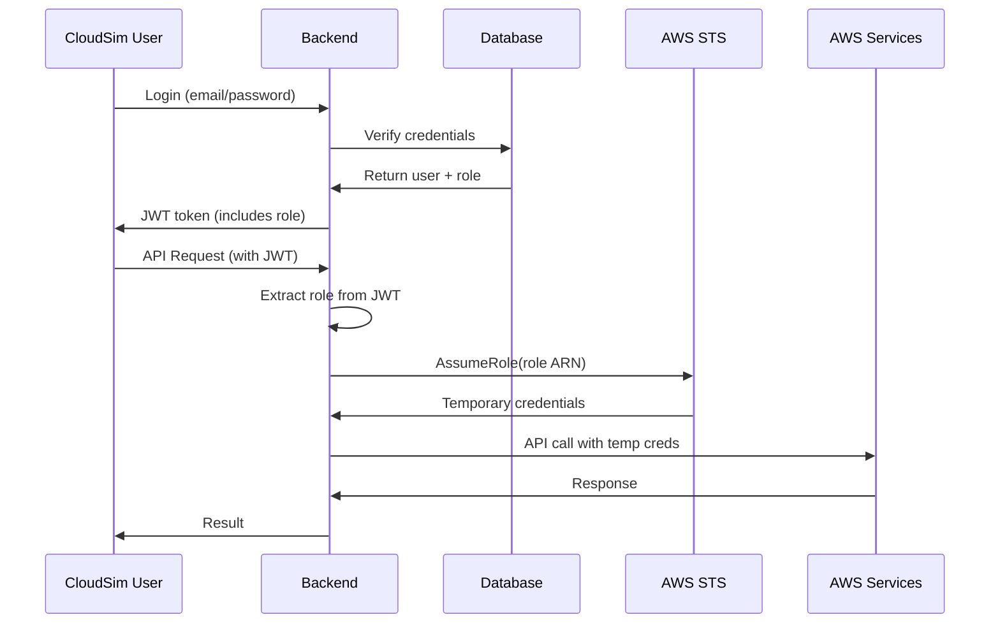

# CloudSim Roles Reference

**Last Updated:** 2026-01-30

---

## Role Structure

CloudSim uses a **3-role system** for access control:

| Role | Permissions | Use Case |
|------|-------------|----------|
| **Admin** | Full access to all features | System administrators |
| **DevOps Engineer** | Full EC2 + CloudWatch + Cost Explorer (including terminate) | DevOps teams managing infrastructure |
| **User** | Start/Stop/Reboot/Terminate own instances + own CloudWatch data | End users |

---

## Detailed Permissions

### Admin Role

**IAM Role:** `CloudSimAdminRole`  
**IAM Policy:** `CloudSimAdminPolicy`

**Permissions:**
- ✅ View all instances
- ✅ Create instances
- ✅ Start/Stop/Reboot all instances
- ✅ Terminate instances
- ✅ View CloudWatch metrics
- ✅ View Cost Explorer data
- ✅ Manage all users

**AWS Actions:**
```
ec2:*
cloudwatch:*
ce:*
```

---

### DevOps Engineer Role

**IAM Role:** `CloudSimDevOpsRole`  
**IAM Policy:** `CloudSimDevOpsPolicy`

**Permissions:**
- ✅ View all instances
- ✅ Create instances
- ✅ Start/Stop/Reboot all instances
- ✅ Terminate all instances
- ✅ View CloudWatch metrics
- ✅ View Cost Explorer data
- ❌ Manage users

**AWS Actions:**
```
ec2:Describe*
ec2:RunInstances
ec2:StartInstances
ec2:StopInstances
ec2:RebootInstances
ec2:TerminateInstances
ec2:CreateTags
cloudwatch:GetMetricStatistics
cloudwatch:GetMetricData
cloudwatch:ListMetrics
cloudwatch:DescribeAlarms
cloudwatch:PutMetricAlarm
cloudwatch:DeleteAlarms
ce:GetCostAndUsage
ce:GetCostForecast
```

**Explicit Denies:**
```
ec2:CreateVpc
ec2:DeleteVpc
ec2:ModifyVpc*
```

---

### User Role

**IAM Role:** `CloudSimUserRole`  
**IAM Policy:** `CloudSimUserPolicy`

**Permissions:**
- ✅ View own instances only
- ❌ Create instances
- ✅ Start/Stop own instances
- ✅ Reboot own instances
- ✅ Terminate own instances
- ✅ View CloudWatch metrics (own instances)
- ✅ View CloudWatch alarms (own instances)
- ❌ View Cost Explorer data
- ❌ Manage users

**AWS Actions:**
```
ec2:DescribeInstances
ec2:DescribeInstanceStatus
ec2:StartInstances (own only)
ec2:StopInstances (own only)
ec2:RebootInstances (own only)
ec2:TerminateInstances (own only)
cloudwatch:GetMetricData (own instances)
cloudwatch:GetMetricStatistics (own instances)
cloudwatch:ListMetrics
cloudwatch:DescribeAlarms (own instances)
```

**Explicit Denies:**
```
ec2:RunInstances
ce:*
```

**Instance Isolation:**
- Users can only see instances tagged with `CreatedBy=<their_user_id>`
- Backend enforces this filter automatically
- CloudWatch data is filtered to own instances only

---

## Test Accounts

| Email | Password | Role | Purpose |
|-------|----------|------|---------|
| admin@gmail.com | admin123 | Admin | Full system access |
| deng@gmail.com | deng123 | DevOps Engineer | Infrastructure management |
| user@gmail.com | user123 | User | Basic end-user access |

---

## Role Mapping Flow



---

## Permission Matrix

| Action | Admin | DevOps Engineer | User |
|--------|-------|-----------------|------|
| View all instances | ✅ | ✅ | ❌ |
| View own instances | ✅ | ✅ | ✅ |
| Create instances | ✅ | ✅ | ❌ |
| Start/Stop | ✅ All | ✅ All | ✅ Own only |
| Reboot | ✅ | ✅ | ✅ Own only |
| Terminate instances | ✅ | ✅ | ✅ Own only |
| View metrics | ✅ | ✅ | ✅ Own only |
| View costs | ✅ | ✅ | ❌ |
| Manage users | ✅ | ❌ | ❌ |

---

## Migration Notes

### Removed: Developer Role

**Previous structure (4 roles):**
- Admin
- **Developer** ← REMOVED
- DevOps Engineer
- User

**Why removed:**
- Simplified role structure
- DevOps Engineer role covers the use case
- Easier to understand and maintain

**If you have existing Developer users:**
1. Update their role in the database to `DevOps Engineer`
2. They will automatically get the new permissions on next login

```sql
-- Migration SQL
UPDATE users 
SET role = 'DevOps Engineer' 
WHERE role = 'Developer';
```

---

## Backend Configuration

Add these to `/home/tinhc/CloudSim/backend/.env`:

```bash
# Enable role-based access
ENABLE_ROLE_BASED_ACCESS=true

# IAM Role ARNs
AWS_ROLE_ADMIN=arn:aws:iam::096615316348:role/CloudSimAdminRole
AWS_ROLE_DEVOPS=arn:aws:iam::096615316348:role/CloudSimDevOpsRole
AWS_ROLE_READONLY=arn:aws:iam::096615316348:role/CloudSimUserRole
```

**Note:** `AWS_ROLE_DEVELOPER` is no longer used and can be removed.

---

## Frontend Role Types

```typescript
// frontend/src/contexts/UserContext.tsx
export type UserRole = 'Admin' | 'DevOps Engineer' | 'User' | null;
```

---

## API Examples

### Create Instance (DevOps Engineer or Admin only)

```bash
curl -X POST http://localhost:8000/api/ec2/instances \
  -H "Authorization: Bearer $TOKEN" \
  -H "Content-Type: application/json" \
  -d '{
    "name": "my-instance",
    "instance_type": "t2.nano"
  }'
```

**Response:**
- ✅ Admin: Success
- ✅ DevOps Engineer: Success
- ❌ User: 403 Forbidden

---

## See Also

- [IAM_Setup_Guide.md](./IAM_Setup_Guide.md) - Complete IAM setup instructions
- [VPC_Setup_Guide.md](./VPC_Setup_Guide.md) - VPC configuration
- [Architecture_Manual.md](./Architecture_Manual.md) - System architecture
