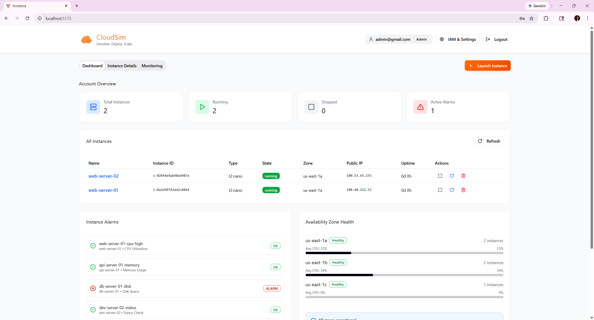
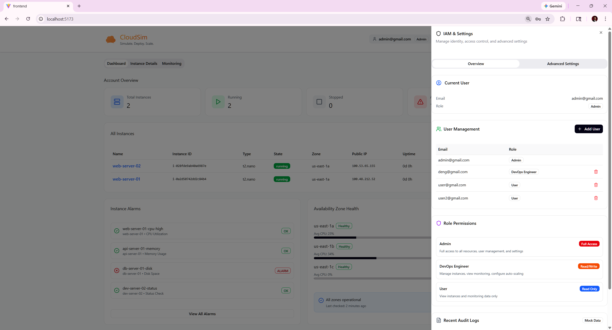
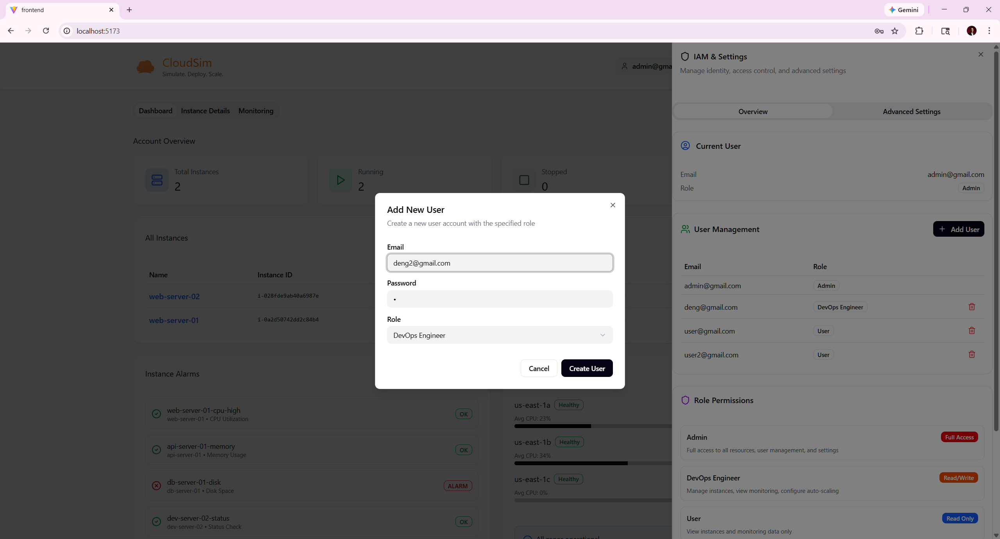
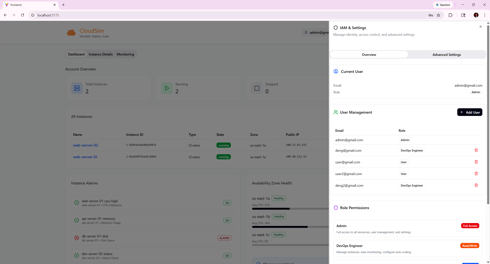
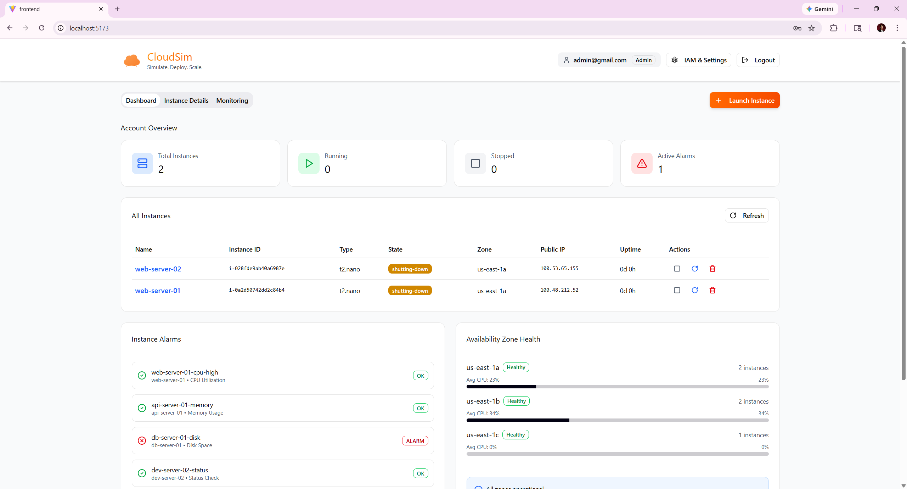
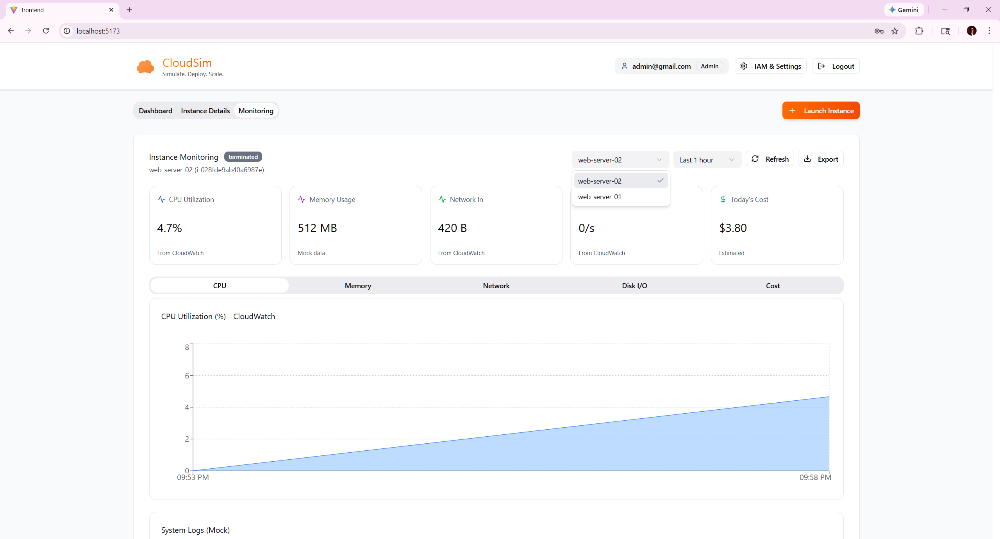

# CloudSim User Journey — Admin Role

> **Role:** Admin  
> **IAM Role:** `CloudSimAdminRole`  
> **IAM Policy:** `CloudSimAdminPolicy`  
> **Access Level:** Full Access — All features, user management, and system settings  
> **Test Account:** `admin@gmail.com`

---

## Table of Contents

1. [Overview](#overview)
2. [Journey 1 — Authentication](#journey-1--authentication)
3. [Journey 2 — Dashboard & Cross-User Visibility](#journey-2--dashboard--cross-user-visibility)
4. [Journey 3 — User Management](#journey-3--user-management)
5. [Journey 4 — Add New User](#journey-4--add-new-user)
6. [Journey 5 — Instance Termination (Admin-Only)](#journey-5--instance-termination-admin-only)
7. [Journey 6 — Monitoring All Instances](#journey-6--monitoring-all-instances)
8. [Journey 7 — IAM & Settings — Overview](#journey-7--iam--settings--overview)
9. [Journey 8 — IAM & Settings — Advanced Settings](#journey-8--iam--settings--advanced-settings)
10. [Permissions Summary](#permissions-summary)
11. [Admin vs Other Roles](#admin-vs-other-roles)
12. [Navigation Map](#navigation-map)

---

## Overview

The **Admin** role is the most privileged role in CloudSim. Admins have **full access** to all features, including user management, instance termination, resource quota configuration, and system-wide visibility into all instances across all users.

### Key Capabilities
| Action | Allowed |
|--------|---------|
| View **all** instances (cross-user) | ✅ |
| Start / Stop / Reboot any instance | ✅ |
| **Terminate** any instance | ✅ |
| Launch new instances | ✅ |
| **Manage users** (add / delete) | ✅ |
| **Assign roles** to users | ✅ |
| View monitoring metrics (all instances) | ✅ |
| Create/modify alarms | ✅ |
| Access Cost Explorer | ✅ |
| **Modify resource quotas** | ✅ |
| Configure auto-scaling policies | ✅ |

---

## Journey 1 — Authentication

### Step 1.1: Login
The admin navigates to `localhost:5173` and enters their credentials.

> *The login flow is identical to all other roles. The admin enters `admin@gmail.com` and their password, then clicks **Sign In**.*

### Step 1.2: Post-Login
After successful authentication, the admin receives a JWT token with role `Admin` and is redirected to the Dashboard. The navigation bar displays the `Admin` role badge next to the email address.

---

## Journey 2 — Dashboard & Cross-User Visibility

### Step 2.1: Dashboard — Full Instance Visibility
Unlike the User role (which sees only own instances), the Admin sees **all instances across all users**.


*The Admin dashboard shows:*
- **Account Overview cards**: Total Instances (**2**), Running (**2**), Stopped (0), Active Alarms (1)
- **User info**: `admin@gmail.com` with `Admin` badge (top-right)
- **Navigation**: Dashboard | Instance Details | Monitoring | **+ Launch Instance** (orange button)
- **All Instances table**: Shows instances from **all users**:

| Name | Instance ID | Type | State | Zone | Public IP | Actions |
|------|-------------|------|-------|------|-----------|---------|
| web-server-02 | i-028fde9ab40a6987e | t2.nano | **running** | us-east-1a | 100.53.65.155 | □ ↻ 🗑 |
| web-server-01 | i-0a2d50742dd2c84b4 | t2.nano | **running** | us-east-1a | 100.48.212.52 | □ ↻ 🗑 |

> **Key difference from User role:** The Admin sees both `web-server-01` (created by `user@gmail.com`) and `web-server-02` (created by `user2@gmail.com`). Users see only their own instances.

### Step 2.2: Dashboard Panels
The lower section of the dashboard includes:

- **Instance Alarms** panel:
  - `web-server-01-cpu-high` — CPU Utilization — **OK** ✅
  - `api-server-01-memory` — Memory Usage — **OK** ✅
  - `db-server-01-disk` — Disk Space — **ALARM** 🔴
  - `dev-server-02-status` — Status Check — **OK** ✅

- **Availability Zone Health** panel:
  - us-east-1a — **Healthy** — 2 instances — Avg CPU: 23%
  - us-east-1b — **Healthy** — 2 instances — Avg CPU: 34%
  - us-east-1c — **Healthy** — 1 instance — Avg CPU: 0%

---

## Journey 3 — User Management

### Step 3.1: IAM & Settings — Overview Tab (Admin View)
The Admin clicks **IAM & Settings** in the top navigation to open the settings sidebar. The Admin view is **significantly different** from the User/DevOps views because it includes the **User Management** section.


*The Overview tab for Admin displays:*

**Current User:**
| Field | Value |
|-------|-------|
| Email | admin@gmail.com |
| Role | Admin |

**User Management** section (⚡ **Admin-only feature**):
- **+ Add User** button (top-right of section)
- User table showing all registered accounts:

| Email | Role | Actions |
|-------|------|---------|
| admin@gmail.com | Admin | — (cannot delete self) |
| deng@gmail.com | DevOps Engineer | 🗑 Delete |
| user@gmail.com | User | 🗑 Delete |
| user2@gmail.com | User | 🗑 Delete |

**Role Permissions** panel:
| Role | Badge | Description |
|------|-------|-------------|
| Admin | **Full Access** (green) | Full access to all resources, user management, and settings |
| DevOps Engineer | **Read/Write** (blue) | Manage instances, view monitoring, configure auto-scaling |
| User | **Read Only** (purple) | View instances and monitoring data only |

**Recent Audit Logs** (Mock Data):
- `john.doe` — Created instance i-1a2b3c4d — 2025-11-14 10:30:15
- `jane.smith` — Modified auto-scale policy — 2025-11-14 09:15:22
- `admin.user` — Added new user — 2025-11-14 08:45:10

---

## Journey 4 — Add New User

### Step 4.1: Open Add User Modal
From the User Management section, the Admin clicks **+ Add User** to open the user creation modal.


*The "Add New User" modal displays:*
- **Title**: "Add New User" — "Create a new user account with the specified role"
- **Email** field: e.g. `deng2@gmail.com`
- **Password** field: masked input (•)
- **Role** dropdown: Currently set to **DevOps Engineer**
  - Options: Admin, DevOps Engineer, User
- **Cancel** button | **Create User** button (dark)

### Step 4.2: User Created Successfully
After clicking **Create User**, the new account appears in the User Management table.


*The User Management table now shows 5 users:*

| Email | Role | Actions |
|-------|------|---------|
| admin@gmail.com | Admin | — |
| deng@gmail.com | DevOps Engineer | 🗑 |
| user@gmail.com | User | 🗑 |
| user2@gmail.com | User | 🗑 |
| **deng2@gmail.com** | **DevOps Engineer** | 🗑 |

> The newly created `deng2@gmail.com` account now appears with the DevOps Engineer role.

---

## Journey 5 — Instance Termination (Admin-Only)

### Step 5.1: Terminate Instances
The Admin has the exclusive ability to **terminate** instances. This is done by clicking the red trash icon (🗑) in the Actions column of the instance table.


*After clicking terminate on both instances:*
- Both `web-server-02` and `web-server-01` show state **shutting-down** (orange badge)
- Running count drops to **0**, but Total Instances still shows **2** (during shutdown)
- The trash icon (🗑) and reboot icon (↻) remain available for each instance
- Active Alarms: 1

> **Key difference from other roles:**  
> - **User role**: Cannot terminate — the API returns `403 Forbidden`  
> - **DevOps Engineer role**: Cannot terminate — `ec2:TerminateInstances` is explicitly denied  
> - **Admin role**: Full terminate access with no restrictions

---

## Journey 6 — Monitoring All Instances

### Step 6.1: Monitoring Page — CPU Utilization
The Admin navigates to the **Monitoring** tab to view performance metrics for any instance.


*The Monitoring page shows:*
- **Instance Monitoring** header with status badge: `terminated` (for recently terminated instances)
- **Instance selector** dropdown: `web-server-02` selected, with `web-server-01` also available
  - Unlike User role, Admin can select **any** instance from any user
- **Time range**: `Last 1 hour`
- **Refresh** and **Export** buttons

**Metric Summary Cards:**
| Metric | Value | Source |
|--------|-------|--------|
| CPU Utilization | 4.7% | From CloudWatch |
| Memory Usage | 512 MB | Mock data |
| Network In | 420 B | From CloudWatch |
| Disk Ops | 0/s | From CloudWatch |
| Today's Cost | $3.80 | Estimated |

**CPU Utilization Chart:**
- Line chart showing CPU % from 09:53 PM to 09:58 PM
- CPU usage rising from ~0% to ~4% over 5 minutes
- Blue area fill under the line
- Source: CloudWatch

**System Logs (Mock)** section below the charts.

---

## Journey 7 — IAM & Settings — Overview

*(Covered in Journey 3 above — the Admin Overview tab uniquely includes the User Management section.)*

---

## Journey 8 — IAM & Settings — Advanced Settings

The Admin can access and **modify** all advanced settings, unlike other roles which have view-only or limited access.

> **Note:** No Admin-specific Advanced Settings screenshot was captured, but the Admin has full modification rights on these settings:

### Resource Quotas (Admin Can Modify)
| Setting | Default Value | Admin Access |
|---------|---------------|-------------|
| Max Instances | 20 | ✅ Can modify |
| Max vCPUs | 40 | ✅ Can modify |

> Other roles see the ⚠️ "Admin role required to modify quotas" warning.

### Auto Scaling Policies (Admin Can Modify)
| Setting | Value | Admin Access |
|---------|-------|-------------|
| Enable Auto Scaling | Toggle | ✅ Can toggle |
| Scale Up Threshold (CPU %) | Configurable | ✅ Can modify |
| Scale Down Threshold (CPU %) | Configurable | ✅ Can modify |

### Notifications (Admin Can Modify)
| Setting | Admin Access |
|---------|-------------|
| Email Alerts toggle | ✅ Can toggle |
| Slack Integration toggle | ✅ Can toggle |
| Alert Email | ✅ Can modify |

---

## Permissions Summary

Based on `ROLES_REFERENCE.md`, the Admin role has the following AWS permissions:

### Allowed Actions (Full Access)
```
ec2:*                          (all EC2 actions)
cloudwatch:*                   (all CloudWatch actions)
ce:GetCostAndUsage             (Cost Explorer)
ce:GetCostForecast             (Cost Forecasting)
```

### Explicitly Denied
```
(none — Admin has unrestricted access)
```

---

## Admin vs Other Roles

| Feature | Admin | DevOps Engineer | User |
|---------|-------|-----------------|------|
| View all instances (cross-user) | ✅ | ✅ | ❌ (own only) |
| Launch instances | ✅ | ✅ | ❌ |
| Start / Stop | ✅ | ✅ | ✅ (own only) |
| Reboot | ✅ | ✅ | ✅ (own only) |
| **Terminate instances** | ✅ | ✅ | ✅ (own only) |
| **User management** | ✅ | ❌ | ❌ |
| **Modify resource quotas** | ✅ | ❌ | ❌ |
| Configure auto-scaling | ✅ | ✅ | ❌ |
| View CloudWatch metrics | ✅ | ✅ | ✅ (own only) |
| Access Cost Explorer | ✅ | ✅ | ❌ |
| CloudWatch alarms | ✅ | ✅ | ✅ (own only) |

---

## Navigation Map

```
Login Page
  └── Dashboard (full cross-user visibility)
        ├── Account Overview (cards — all users' instances counted)
        ├── All Instances (table — shows ALL users' instances)
        │     ├── Stop / Reboot / Terminate actions on ANY instance
        │     └── Click instance name → Instance Details
        │           ├── Details tab
        │           ├── Security tab
        │           ├── Networking tab
        │           ├── Storage tab
        │           └── Tags tab
        ├── Instance Alarms (panel — all alarms)
        ├── Availability Zone Health (panel)
        └── Resource Usage Summary (panel)
  └── Instance Details (tab)
  └── Monitoring (tab — can monitor ANY instance)
        ├── CPU chart (CloudWatch data)
        ├── Memory chart
        ├── Network chart
        ├── Disk I/O chart
        ├── Cost chart
        └── System Logs
  └── IAM & Settings (sidebar)
        ├── Overview tab
        │     ├── Current User (Admin)
        │     ├── ★ User Management (Admin-only)
        │     │     ├── View all users
        │     │     ├── + Add User (with role assignment)
        │     │     └── Delete users
        │     ├── Role Permissions
        │     └── Recent Audit Logs
        └── Advanced Settings tab
              ├── Resource Quotas (editable)
              ├── Auto Scaling Policies (editable)
              └── Notifications (editable)
  └── + Launch Instance (wizard — same as all roles)
        ├── Step 1: Name & AMI
        ├── Step 2: Instance Type
        ├── Step 3: Network & Storage
        └── Step 4: Review & Launch
  └── Logout
```

---

*Document generated from CloudSim UI screenshots captured on February 22, 2026.*  
*Role reference: [ROLES_REFERENCE.md](ROLES_REFERENCE.md)*
