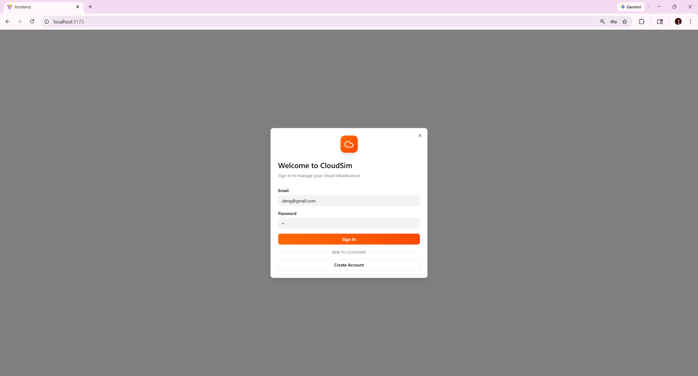
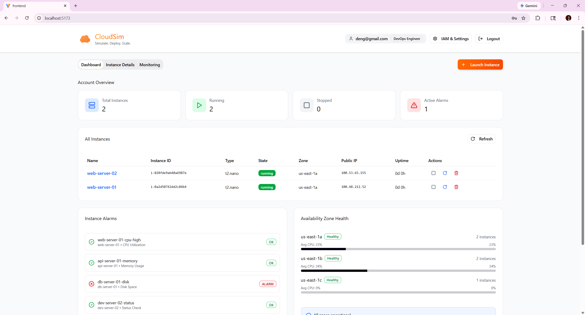
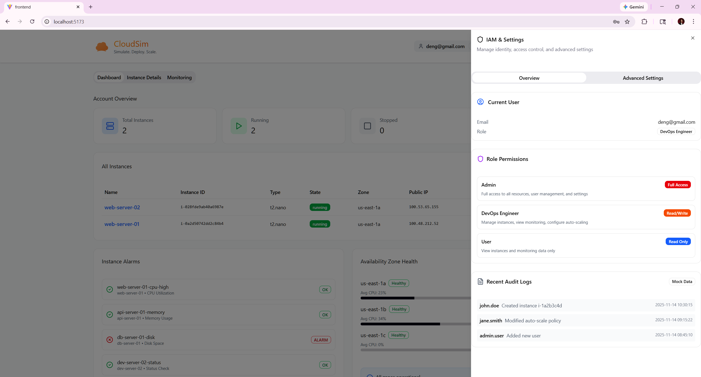
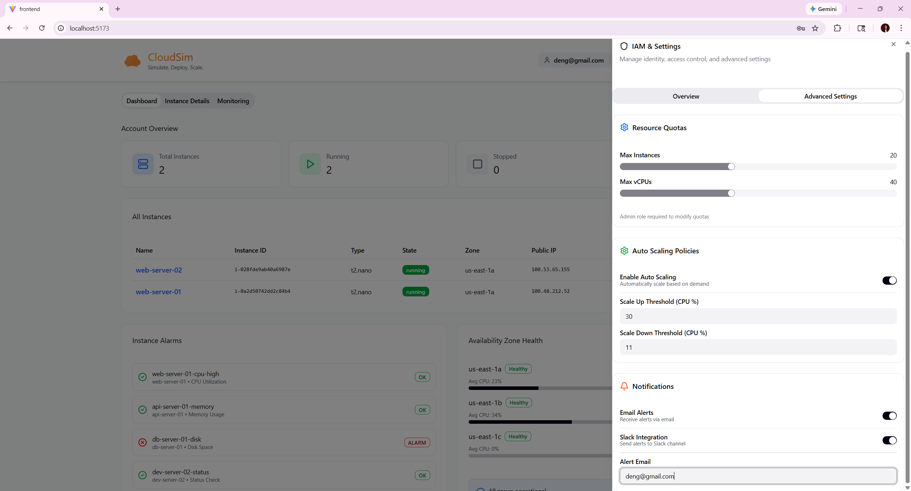

# CloudSim User Journey — DevOps Engineer Role

> **Role:** DevOps Engineer  
> **IAM Role:** `CloudSimDevOpsRole`  
> **IAM Policy:** `CloudSimDevOpsPolicy`  
> **Access Level:** Read/Write — Full EC2 + CloudWatch + Cost Explorer (including terminate, no user management or quotas)  
> **Test Account:** `deng@gmail.com`

---

## Table of Contents

1. [Overview](#overview)
2. [Journey 1 — Authentication](#journey-1--authentication)
3. [Journey 2 — Dashboard & Instance Visibility](#journey-2--dashboard--instance-visibility)
4. [Journey 3 — Instance Management](#journey-3--instance-management)
5. [Journey 4 — Monitoring & CloudWatch](#journey-4--monitoring--cloudwatch)
6. [Journey 5 — IAM & Settings — Overview](#journey-5--iam--settings--overview)
7. [Journey 6 — IAM & Settings — Advanced Settings](#journey-6--iam--settings--advanced-settings)
8. [Journey 7 — Restrictions & Denied Actions](#journey-7--restrictions--denied-actions)
9. [Permissions Summary](#permissions-summary)
10. [DevOps vs Other Roles](#devops-vs-other-roles)
11. [Navigation Map](#navigation-map)

---

## Overview

The **DevOps Engineer** role is the mid-tier role in CloudSim, designed for DevOps teams managing infrastructure. DevOps Engineers have **read/write** access to EC2 instances, CloudWatch monitoring, and Cost Explorer. They can launch, start, stop, reboot, and terminate instances, but they **cannot manage users** or **modify resource quotas**.

### Key Capabilities
| Action | Allowed |
|--------|---------|
| View all instances (cross-user) | ✅ |
| Start / Stop / Reboot instances | ✅ |
| Launch new instances | ✅ |
| **Terminate** instances | ✅ |
| View monitoring metrics | ✅ |
| Create/modify CloudWatch alarms | ✅ |
| Access Cost Explorer | ✅ |
| Configure auto-scaling | ✅ |
| **Manage users** | ❌ |
| **Modify resource quotas** | ❌ |

---

## Journey 1 — Authentication

### Step 1.1: Login
The DevOps Engineer navigates to `localhost:5173` and enters credentials.


*The login page shows:*
- **CloudSim logo** (orange cloud icon)
- **Title**: "Welcome to CloudSim" — "Sign in to manage your cloud infrastructure"
- **Email** field: `deng@gmail.com`
- **Password** field: masked (•)
- **Sign In** button (orange gradient)
- **"NEW TO CLOUDSIM?"** text with **Create Account** button below

### Step 1.2: Post-Login
After successful authentication, the DevOps Engineer receives a JWT token with role `DevOps Engineer` and is redirected to the Dashboard. The navigation bar displays `deng@gmail.com` with `DevOps Engineer` role badge.

---

## Journey 2 — Dashboard & Instance Visibility

### Step 2.1: Dashboard — Cross-User Visibility
Like the Admin, the DevOps Engineer can see **all instances across all users** — not just their own.


*The DevOps Engineer dashboard shows:*
- **User info**: `deng@gmail.com` with `DevOps Engineer` badge
- **Account Overview cards**: Total Instances (**2**), Running (**2**), Stopped (0), Active Alarms (1)
- **Navigation**: Dashboard | Instance Details | Monitoring | **+ Launch Instance** (orange button)

**All Instances table — full cross-user view:**
| Name | Instance ID | Type | State | Zone | Public IP | Uptime | Actions |
|------|-------------|------|-------|------|-----------|--------|---------|
| web-server-02 | i-028fde9ab40a6987e | t2.nano | **running** | us-east-1a | 100.53.65.155 | 0d 0h | □ ↻ 🗑 |
| web-server-01 | i-0a2d50742dd2c84b4 | t2.nano | **running** | us-east-1a | 100.48.212.52 | 0d 0h | □ ↻ 🗑 |

> **Key observation:** The DevOps Engineer sees both `web-server-01` (created by `user@gmail.com`) and `web-server-02` (created by `user2@gmail.com`). This is the same cross-user visibility as the Admin role.

> **Important note on Actions column:** The DevOps Engineer can fully manage (including terminate) any instance across all users.

### Step 2.2: Dashboard Panels
The lower section includes:

- **Instance Alarms** panel:
  - `web-server-01-cpu-high` — CPU Utilization — **OK** ✅
  - `api-server-01-memory` — Memory Usage — **OK** ✅
  - `db-server-01-disk` — Disk Space — **ALARM** 🔴
  - `dev-server-02-status` — Status Check — **OK** ✅

- **Availability Zone Health** panel:
  - us-east-1a — **Healthy** — 2 instances — Avg CPU: 23%
  - us-east-1b — **Healthy** — 2 instances — Avg CPU: 34%
  - us-east-1c — **Healthy** — 1 instance — Avg CPU: 0%

---

## Journey 3 — Instance Management

### Step 3.1: Launch New Instance
The DevOps Engineer can launch new EC2 instances using the same 4-step wizard as all other roles:

1. **Step 1 of 4**: Instance Name & AMI Selection
   - Name the instance and choose from Amazon Linux 2023, Ubuntu Server 22.04 LTS, or Windows Server 2022 Base
2. **Step 2 of 4**: Instance Type Selection
   - Choose from t2.nano (Free tier), t2.small, t2.medium, t2.large
3. **Step 3 of 4**: Network & Storage Configuration
   - Configure VPC, Subnet, Security Group, and storage
4. **Step 4 of 4**: Review and Launch
   - Review all settings and estimated monthly cost, then click **Launch Instance**

### Step 3.2: Instance Lifecycle Management
The DevOps Engineer can perform the following actions on **any** instance:

| Action | Method | Result |
|--------|--------|--------|
| **Stop** | Click □ icon in Actions column | Instance transitions to `stopping` → `stopped` |
| **Reboot** | Click ↻ icon in Actions column | Instance restarts without state change |
| **Start** | Click ▶ icon (when stopped) | Instance transitions to `pending` → `running` |
| **Terminate** | Click 🗑 icon | Instance transitions to `shutting-down` → `terminated` |

---

## Journey 4 — Monitoring & CloudWatch

The DevOps Engineer has full access to monitoring features, including CloudWatch metrics and Cost Explorer data.

### Step 4.1: Monitoring Page
The DevOps Engineer navigates to the **Monitoring** tab. The monitoring interface is identical to the Admin view:

- **Instance selector** dropdown to choose any instance
- **Time range** selector (Last 1 hour, Last 3 hours, Last 6 hours, etc.)
- **Refresh** and **Export** buttons
- **Metric summary cards**: CPU Utilization, Memory Usage, Network In, Disk Ops, Today's Cost

### Step 4.2: Monitoring Tabs
| Tab | Content |
|-----|---------|
| **CPU** | CPU Utilization (%) chart — sourced from CloudWatch |
| **Memory** | Memory Usage (MB) chart — used vs available |
| **Network** | Network Traffic (KB/s) chart — in/out data |
| **Disk I/O** | Disk I/O (ops/s) chart — read/write operations |
| **Cost** | Daily Cost Trend — compute/storage/network breakdown |

### Step 4.3: System Logs
Below the charts, the **System Logs (Mock)** section displays timestamped log entries with INFO/WARN level tags.

---

## Journey 5 — IAM & Settings — Overview

### Step 5.1: Overview Tab (DevOps View)
The DevOps Engineer clicks **IAM & Settings** to open the settings sidebar.


*The Overview tab for DevOps Engineer displays:*

**Current User:**
| Field | Value |
|-------|-------|
| Email | deng@gmail.com |
| Role | DevOps Engineer |

> **Key difference from Admin:** No **User Management** section is shown. The DevOps Engineer cannot add, delete, or modify users.

**Role Permissions** panel:
| Role | Badge | Description |
|------|-------|-------------|
| Admin | **Full Access** (green) | Full access to all resources, user management, and settings |
| DevOps Engineer | **Read/Write** (blue) | Manage instances, view monitoring, configure auto-scaling |
| User | **Read Only** (purple) | View instances and monitoring data only |

**Recent Audit Logs** (Mock Data):
- `john.doe` — Created instance i-1a2b3c4d — 2025-11-14 10:30:15
- `jane.smith` — Modified auto-scale policy — 2025-11-14 09:15:22
- `admin.user` — Added new user — 2025-11-14 08:45:10

---

## Journey 6 — IAM & Settings — Advanced Settings

### Step 6.1: Advanced Settings Tab (DevOps View)
The DevOps Engineer switches to the **Advanced Settings** tab.


*The Advanced Settings tab for DevOps Engineer shows:*

**Resource Quotas** (view-only):
| Setting | Value | Access |
|---------|-------|--------|
| Max Instances | 20 (slider) | 👁 View only |
| Max vCPUs | 40 (slider) | 👁 View only |
| | ⚠️ "Admin role required to modify quotas" | |

**Auto Scaling Policies** (✅ DevOps can configure):
| Setting | Value |
|---------|-------|
| Enable Auto Scaling | **Toggle ON** (enabled) ✅ |
| Scale Up Threshold (CPU %) | 30 |
| Scale Down Threshold (CPU %) | 11 |

> **Key difference from User role:** The DevOps Engineer can **toggle and configure** auto-scaling policies. The User role has these as view-only/disabled.

**Notifications**:
| Setting | Value |
|---------|-------|
| Email Alerts | **Toggle ON** ✅ |
| Slack Integration | **Toggle ON** ✅ |
| Alert Email | `deng@gmail.com` |

---

## Journey 7 — Restrictions & Denied Actions

The DevOps Engineer role has two primary restrictions:

### 7.1: Cannot Manage Users
The User Management section is **completely hidden** from the DevOps Engineer's IAM & Settings view. There is no UI affordance to:
- View the user list
- Add new users
- Delete users
- Modify user roles

### 7.2: Cannot Modify Resource Quotas
Resource quotas (Max Instances, Max vCPUs) are displayed as **view-only** with sliders disabled and the warning message: *"Admin role required to modify quotas"*.

---

## Permissions Summary

Based on `ROLES_REFERENCE.md`, the DevOps Engineer role has the following AWS permissions:

### Allowed Actions
```
ec2:DescribeInstances
ec2:DescribeInstanceStatus
ec2:RunInstances
ec2:StartInstances
ec2:StopInstances
ec2:RebootInstances
ec2:CreateTags
ec2:DescribeSecurityGroups
ec2:DescribeSubnets
ec2:DescribeVpcs
ec2:DescribeImages
ec2:DescribeKeyPairs
ec2:DescribeVolumes
cloudwatch:GetMetricData
cloudwatch:GetMetricStatistics
cloudwatch:ListMetrics
cloudwatch:DescribeAlarms
cloudwatch:PutMetricAlarm
cloudwatch:DeleteAlarms
ce:GetCostAndUsage
ce:GetCostForecast
```

### Explicitly Denied
```
ec2:CreateVpc
ec2:DeleteVpc
ec2:ModifyVpc*
```

---

## DevOps vs Other Roles

| Feature | Admin | DevOps Engineer | User |
|---------|-------|-----------------|------|
| View all instances (cross-user) | ✅ | ✅ | ❌ (own only) |
| Launch instances | ✅ | ✅ | ❌ |
| Start / Stop | ✅ | ✅ (any) | ✅ (own only) |
| Reboot | ✅ | ✅ | ✅ (own only) |
| **Terminate instances** | ✅ | ✅ | ✅ (own only) |
| **User management** | ✅ | ❌ | ❌ |
| **Modify resource quotas** | ✅ | ❌ | ❌ |
| **Configure auto-scaling** | ✅ | ✅ | ❌ |
| View CloudWatch metrics | ✅ | ✅ | ✅ (own only) |
| Access Cost Explorer | ✅ | ✅ | ❌ |
| **CloudWatch alarms** | ✅ | ✅ | ✅ (own only) |

---

## Navigation Map

```
Login Page (deng@gmail.com)
  └── Dashboard (cross-user visibility — sees all instances)
        ├── Account Overview (cards — all instances counted)
        ├── All Instances (table — shows ALL users' instances)
        │     ├── Stop / Reboot / Terminate actions on ANY instance ✅
        │     └── Click instance name → Instance Details
        │           ├── Details tab
        │           ├── Security tab
        │           ├── Networking tab
        │           ├── Storage tab
        │           └── Tags tab
        ├── Instance Alarms (panel)
        ├── Availability Zone Health (panel)
        └── Resource Usage Summary (panel)
  └── Instance Details (tab)
  └── Monitoring (tab — can monitor ANY instance)
        ├── CPU chart (CloudWatch data)
        ├── Memory chart
        ├── Network chart
        ├── Disk I/O chart
        ├── Cost chart
        └── System Logs
  └── IAM & Settings (sidebar)
        ├── Overview tab
        │     ├── Current User (DevOps Engineer)
        │     ├── ✗ User Management (NOT available)
        │     ├── Role Permissions
        │     └── Recent Audit Logs
        └── Advanced Settings tab
              ├── Resource Quotas (view-only)
              ├── Auto Scaling Policies (editable ✅)
              └── Notifications (editable ✅)
  └── + Launch Instance (wizard — same as all roles)
        ├── Step 1: Name & AMI
        ├── Step 2: Instance Type
        ├── Step 3: Network & Storage
        └── Step 4: Review & Launch
  └── Logout
```

---

*Document generated from CloudSim UI screenshots captured on February 22, 2026.*  
*Role reference: [ROLES_REFERENCE.md](ROLES_REFERENCE.md)*
