# CloudSim User Journey - User Role

> **Role:** User  
> **IAM Role:** `CloudSimUserRole`  
> **IAM Policy:** `CloudSimUserPolicy`  
> **Access Level:** Restricted - Manage (start/stop/reboot/terminate) own instances + view own metrics  
> **Test Account:** `user@gmail.com`, `user2@gmail.com`

## Persona

**Alex** — Junior Full-Stack Developer working at a startup.

## Scenario

Alex works at a small startup where the DevOps engineer provisions EC2 instances for the team using CloudSim. Alex's day-to-day involves deploying code to a pre-provisioned instance, restarting it when a deployment goes sideways, and keeping an eye on CPU and memory to make sure nothing is on fire. Alex logs into CloudSim a few times a week to check instance health, review CloudWatch alarms, and occasionally stop an instance overnight to save costs. The team uses CloudSim's Role-Based Access Control (RBAC) system to ensure Alex can only see and manage instances tagged with his user ID - no risk of accidentally touching a teammate's production box.

## Goals

- **Check instance health quickly**: see at a glance if his instance is running, stopped, or throwing alarms
- **Perform lifecycle actions independently**: start, stop, reboot, or terminate his own instances
- **Monitor workload performance**: review CPU, memory, network, and disk metrics through CloudWatch to catch issues early
- **Stay within his lane**: work confidently knowing he can't accidentally affect another team member's resources

## Journey Stages

| Stage | Description |
|-------|-------------|
| **Authentication** | User logs in and receives role-scoped access |
| **Dashboard Orientation** | User surveys his instance inventory and alarm health |
| **Instance Management** | User drills into instance details, inspects configuration tabs, and performs lifecycle actions |
| **Monitoring & Metrics** | User reviews CloudWatch data, cost estimates, and system logs for his instances |
| **Settings & Permissions** | User views his role, quotas, and notification preferences (mostly read-only) |
| **Multi-User Isolation** | User experiences resource isolation - cannot see other users' instances |

## Stage 1 - Authentication

Alex navigates to `localhost:5173` and is presented with the CloudSim login modal featuring the orange cloud logo, email and password fields, and a "Sign In" button. After entering his credentials (`user@gmail.com`) and clicking Sign In, the backend authenticates the request and returns a JWT token containing the `User` role. The user is redirected to the Dashboard with his email and a `User` badge displayed in the top navigation bar.

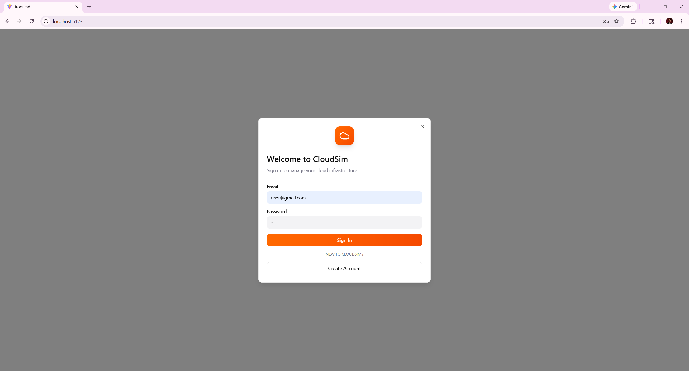
*Credentials filled in for the User test account. The orange "Sign In" button is prominent.*

## Stage 2 - Dashboard Orientation

Upon landing on the Dashboard, Alex sees a high-level summary of his cloud resources. Account Overview cards display counts for Total Instances, Running, Stopped, and Active Alarms. Below, the All Instances table lists his instances with name, ID, type, state, availability zone, public IP, uptime, and action buttons (Stop, Reboot, Terminate). Additional panels show Instance Alarms with OK/ALARM statuses, Availability Zone Health across `us-east-1a/b/c`, and a Resource Usage Summary for vCPU, Memory, and EBS Storage.

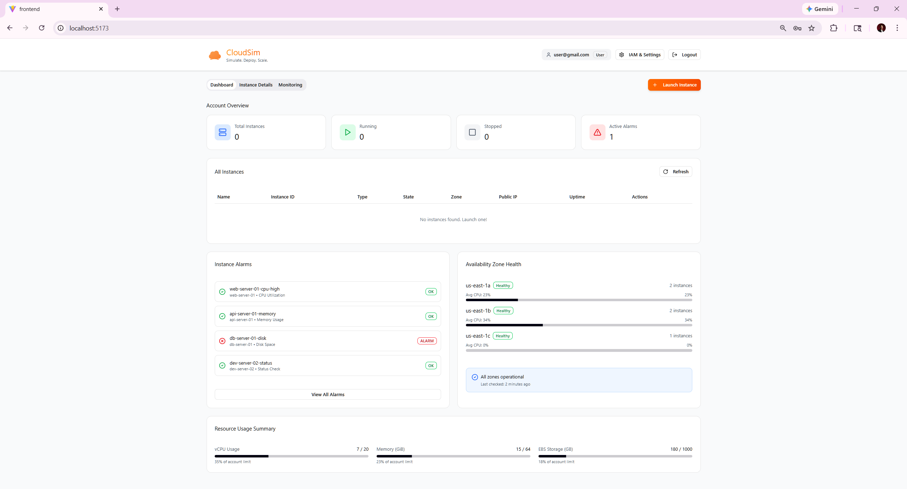
*Dashboard with zero instances, showing alarm panel, AZ health, and resource usage summary.*

The top navigation provides tabs for Dashboard, Instance Details, and Monitoring, along with a prominent orange **+ Launch Instance** button, user info with role badge, and links to IAM & Settings and Logout.

> **Decision point:** The user must decide whether to launch a new instance or manage existing ones.

## Stage 3 - Instance Launch

Alex clicks **+ Launch Instance** and enters the 4-step wizard. Step 1 asks for an instance name and AMI selection (Amazon Linux 2023, Ubuntu 22.04 LTS, or Windows Server 2022). Step 2 presents instance type options (t2.nano through t2.large) with vCPU, memory, and hourly pricing. Step 3 configures network and storage settings. Step 4 displays a full review summary including VPC, subnet, security group, storage, and estimated monthly cost.

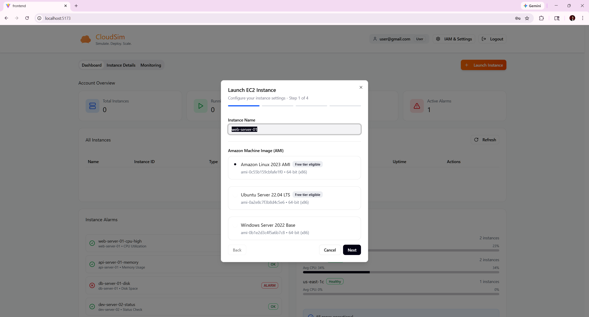
*Step 1: Instance naming and AMI selection with three OS options.*

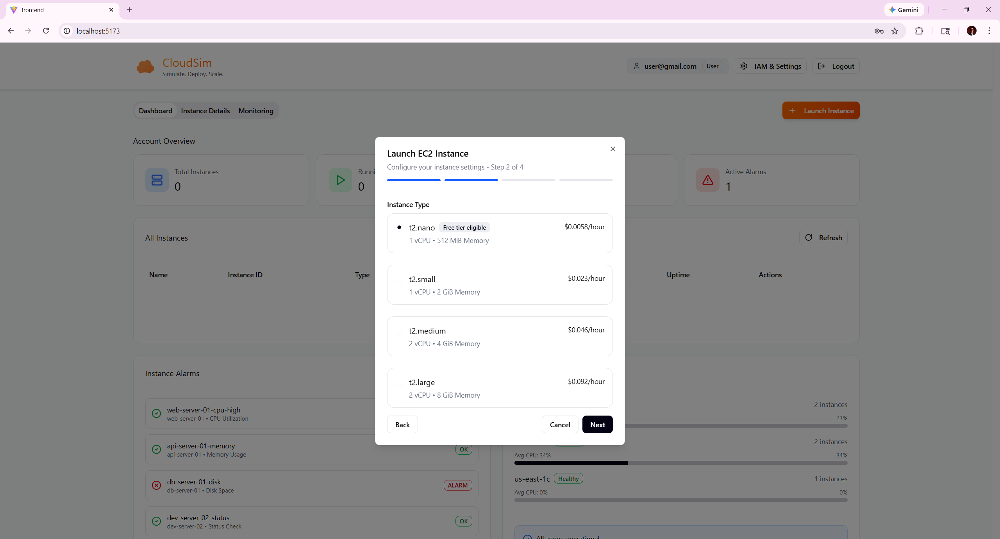
*Step 2: Instance type selection with pricing breakdown.*

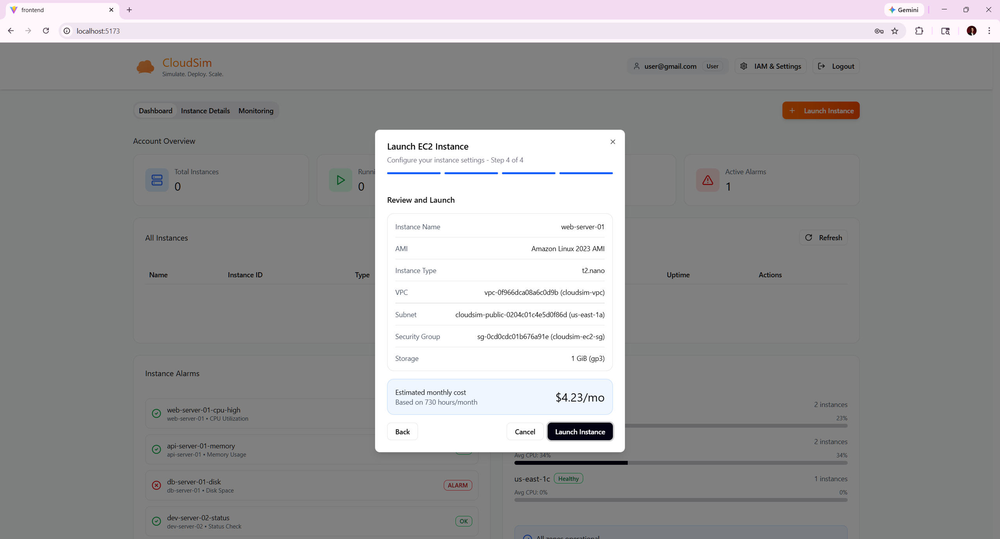
*Step 4: Full configuration review showing an estimated $4.23/mo cost.*

## Stage 4 - Instance Management

After an instance is provisioned, Alex's dashboard updates to reflect it. The Account Overview cards show the running count, and the All Instances table displays the instance with its name, state, type, zone, public IP, and action buttons. Alex can Stop, Reboot, or Terminate his own instances directly from the table.

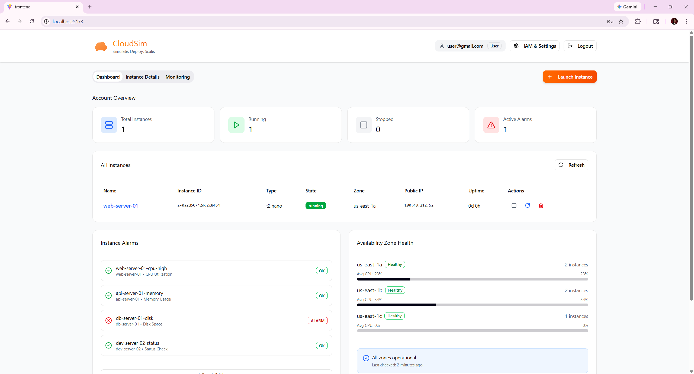
*Dashboard showing `web-server-01` running with action buttons for stop, reboot, and terminate.*

Clicking the instance name navigates to the **Instance Details** page, which features a header with the instance name, running badge, instance ID, and quick-info cards (Instance Type, Availability Zone, Public IPv4, Private IPv4). Action buttons for Configure, Start, Stop, Reboot, and Terminate are available for the user's own instances.

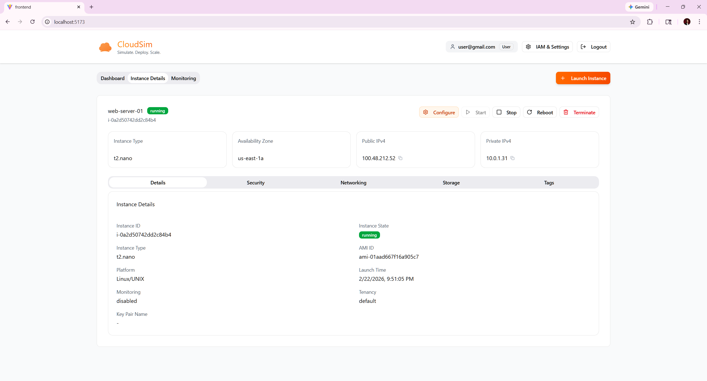
*Instance Details page showing header info and the Details tab with instance metadata.*

The details view is organized into five tabs, each providing a focused slice of instance configuration:

**Details Tab** - Core metadata including Instance ID, State, Type, AMI ID, Platform, Launch Time, Monitoring status, Tenancy, and Key Pair Name.

**Security Tab** - Security Groups assigned to the instance and IAM Instance Profile ARN.

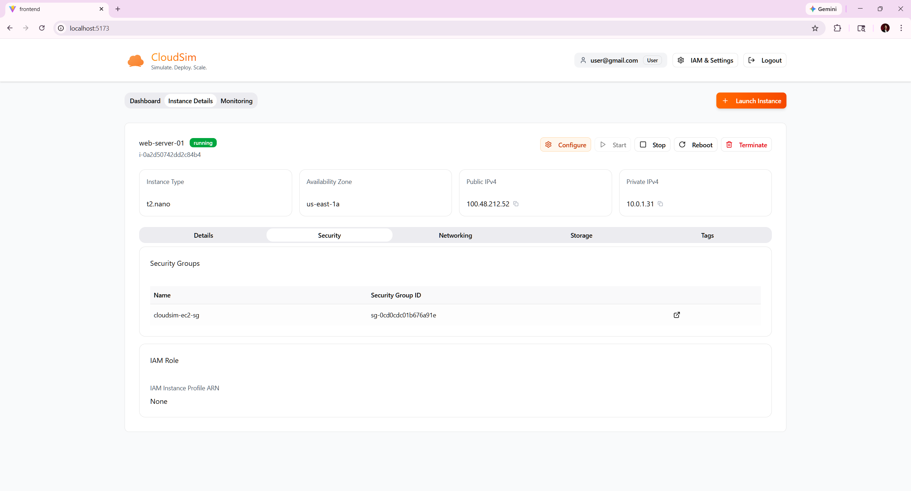
*Security tab showing assigned security group `cloudsim-ec2-sg`.*

**Networking Tab** - VPC ID, Subnet ID, Public DNS, and Private DNS information.

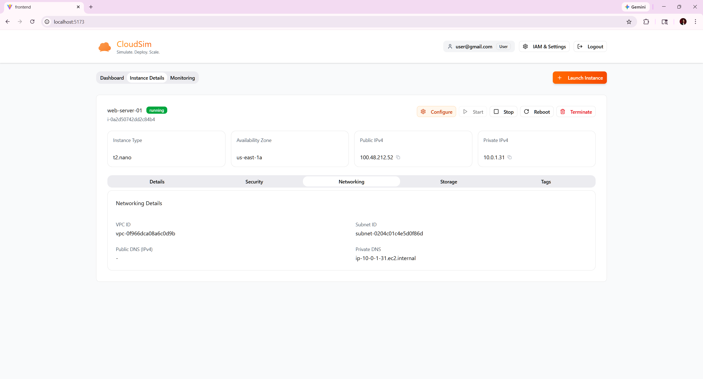
*Networking tab with VPC and subnet details.*

**Storage Tab** - Block device mappings showing EBS volume ID, type, size, IOPS, encryption status, and delete-on-termination flag.

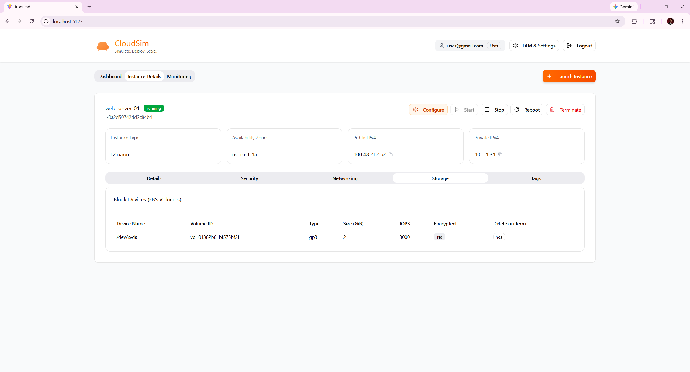
*Storage tab listing the attached gp3 EBS volume.*

**Tags Tab** - Resource tags including `CreatedByEmail`, `CreatedBy`, `ManagedBy`, and `Name`.

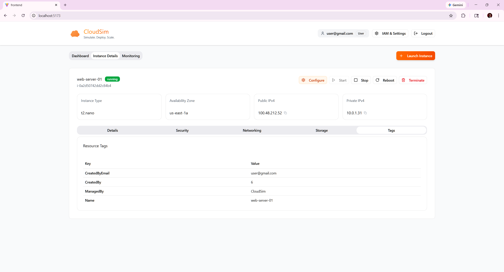
*Tags tab showing ownership and management metadata.*

## Stage 5 — Monitoring & Metrics

Alex navigates to the **Monitoring** tab to review performance data for his instances. The page provides an instance selector dropdown, time range selector (Last 1 hour, etc.), and Refresh/Export buttons. Metric summary cards at the top show CPU Utilization, Memory Usage, Network In, Disk Ops, and Today's Cost at a glance.

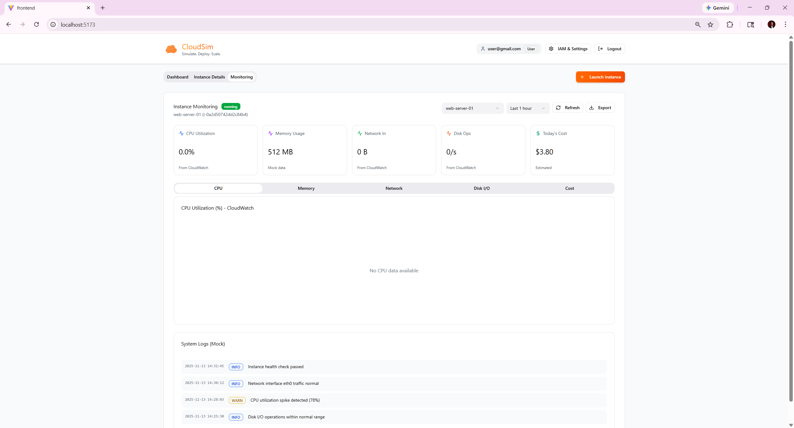
*Monitoring page with CPU tab selected, metric summary cards, and system logs.*

The monitoring view is split into five tabs - **CPU**, **Memory**, **Network**, **Disk I/O**, and **Cost** - each rendering a time-series chart for the selected instance and time range. Below the charts, a System Logs section displays timestamped mock log entries with INFO/WARN level tags.

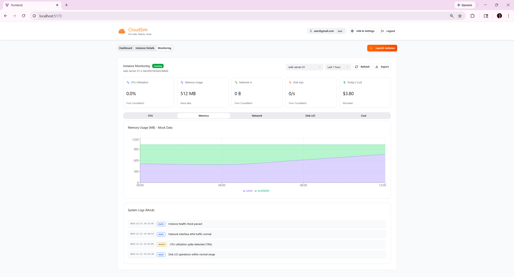
*Memory Usage chart showing used (purple) and available (green) memory over time.*

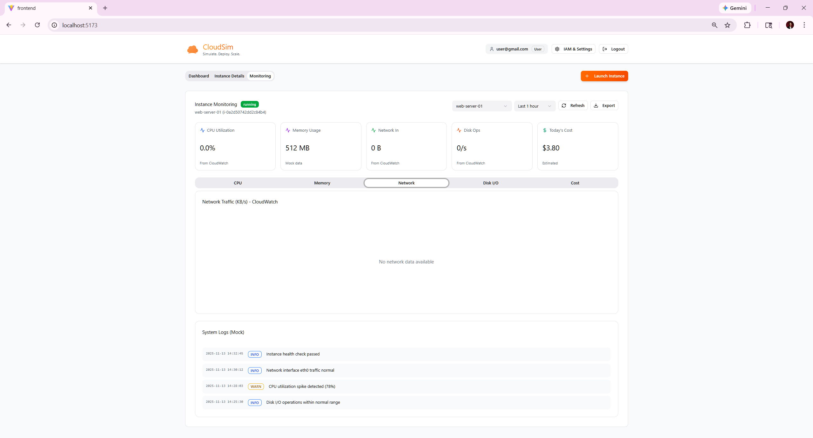
*Network Traffic tab*

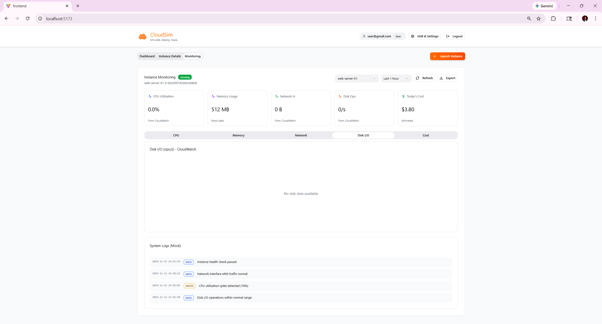
*Disk I/O tab*

## Stage 6 - Settings & Permissions

Alex clicks **IAM & Settings** in the top navigation to open the settings sidebar. The **Overview tab** displays his email and role, a Role Permissions panel showing all three role levels (Admin - Full Access; DevOps Engineer - Read/Write; User - Read Only), and Recent Audit Logs with mock entries.

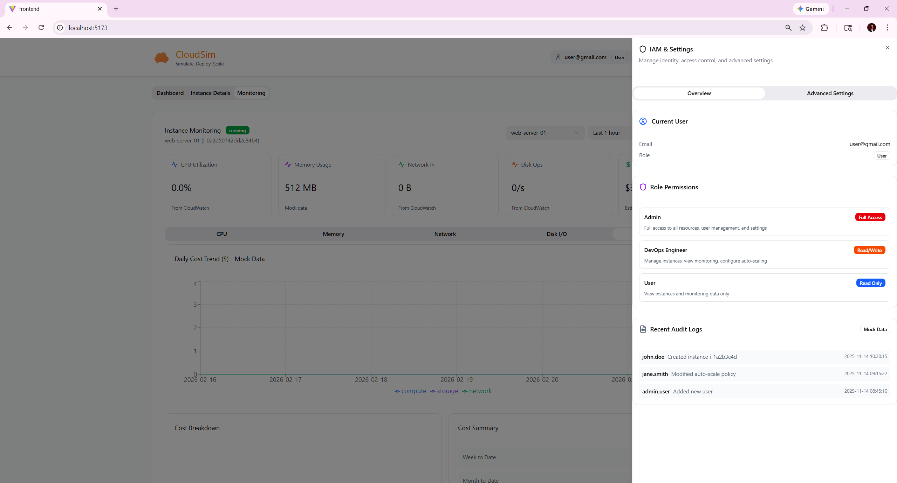
*Overview tab showing current user info, role permissions breakdown, and audit logs.*

The **Advanced Settings tab** shows Resource Quotas (Max Instances: 20, Max vCPUs: 40) as view-only. Auto Scaling Policies are displayed but disabled for the User role. Notification toggles for Email Alerts and Slack Integration are visible along with the alert email address.

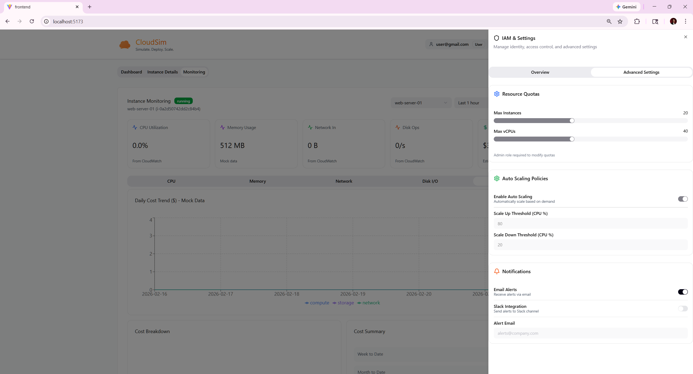
*Advanced Settings tab with view-only quotas, disabled auto-scaling, and notification preferences.*

## Stage 7 - Multi-User Isolation

CloudSim enforces strict resource isolation between users. Each user can only see and manage instances they created, enforced at the backend level using the `CreatedBy` tag. When a different user (`user2@gmail.com`) logs in, their dashboard shows only their own instances — they cannot see `web-server-01` created by `user@gmail.com`.


*The `user2@gmail.com` dashboard showing only `web-server-02` — complete isolation from other users' resources.*

## Permissions Summary

### Allowed Actions
```
ec2:DescribeInstances
ec2:DescribeInstanceStatus
ec2:StartInstances       (own instances only, via backend filter)
ec2:StopInstances        (own instances only, via backend filter)
ec2:RebootInstances      (own instances only, via backend filter)
ec2:TerminateInstances   (own instances only, via backend filter)
cloudwatch:GetMetricData (own instances)
cloudwatch:GetMetricStatistics (own instances)
cloudwatch:ListMetrics
cloudwatch:DescribeAlarms (own instances)
```

### Explicitly Denied
```
ce:*                     (no Cost Explorer access)
```

## Navigation Map

```
Login Page
  └── Dashboard
        ├── Account Overview (cards)
        ├── All Instances (table)
        │     └── Click instance name → Instance Details
        │           ├── Details tab
        │           ├── Security tab
        │           ├── Networking tab
        │           ├── Storage tab
        │           └── Tags tab
        ├── Instance Alarms (panel)
        ├── Availability Zone Health (panel)
        └── Resource Usage Summary (panel)
  └── Instance Details (tab)
  └── Monitoring (tab)
        ├── CPU chart
        ├── Memory chart
        ├── Network chart
        ├── Disk I/O chart
        ├── Cost chart
        └── System Logs
  └── IAM & Settings (sidebar)
        ├── Overview tab
        └── Advanced Settings tab
  └── + Launch Instance (wizard)
        ├── Step 1: Name & AMI
        ├── Step 2: Instance Type
        ├── Step 3: Network & Storage
        └── Step 4: Review & Launch
  └── Logout
```
