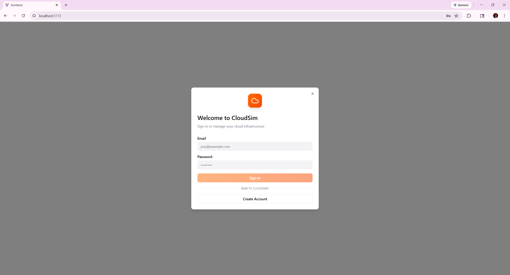

# CloudSim User Journey — User Role

> **Role:** User  
> **IAM Role:** `CloudSimUserRole`  
> **IAM Policy:** `CloudSimUserPolicy`  
> **Access Level:** Restricted — Manage (start/stop/reboot/terminate) own instances + view own metrics  
> **Test Account:** `user@gmail.com`

---

## Table of Contents

1. [Overview](#overview)
2. [Journey 1 — Authentication](#journey-1--authentication)
3. [Journey 2 — Dashboard Overview](#journey-2--dashboard-overview)
4. [Journey 3 — Launch EC2 Instance (4-Step Wizard)](#journey-3--launch-ec2-instance-4-step-wizard)
5. [Journey 4 — Instance Details & Management](#journey-4--instance-details--management)
6. [Journey 5 — Instance Monitoring](#journey-5--instance-monitoring)
7. [Journey 6 — IAM & Settings](#journey-6--iam--settings)
8. [Journey 7 — Multi-User Isolation](#journey-7--multi-user-isolation)
9. [Permissions Summary](#permissions-summary)
10. [Navigation Map](#navigation-map)

---

## Overview

The **User** role is the most restricted role in CloudSim. Users can view, start, stop, reboot, and terminate their own instances. They can also view CloudWatch metrics and alarms for their own instances. They **cannot** launch new instances, access Cost Explorer, or manage other users.

### Key Capabilities
| Action | Allowed |
|--------|---------|
| View own instances | ✅ |
| Start / Stop own instances | ✅ |
| Reboot own instances | ✅ |
| Terminate own instances | ✅ |
| Launch new instances | ❌ |
| View CloudWatch metrics | ✅ (own instances) |
| CloudWatch alarms | ✅ (own instances) |
| Access Cost Explorer | ❌ |
| Manage users | ❌ |
| Modify resource quotas | ❌ |

---

## Journey 1 — Authentication

### Step 1.1: Access Login Page
The user navigates to `localhost:5173` and is presented with the CloudSim login modal.


*The login page features the CloudSim logo, email/password fields, a "Sign In" button, and a "Create Account" option for new users.*

### Step 1.2: Enter Credentials
The user enters their email (`user@gmail.com`) and password, then clicks **Sign In**.


*Credentials filled in for the User test account. The orange "Sign In" button is prominent.*

### Step 1.3: Post-Login
After successful authentication, the user receives a JWT token containing their role (`User`) and is redirected to the **Dashboard**.

---

## Journey 2 — Dashboard Overview

### Step 2.1: Account Overview
Upon login, the user lands on the Dashboard showing a high-level summary of their cloud resources.


*The dashboard displays:*
- **Account Overview cards**: Total Instances (0), Running (0), Stopped (0), Active Alarms (1)
- **All Instances table**: Shows "No instances found. Launch one!" when empty
- **Instance Alarms panel**: Lists alarm statuses (OK/ALARM) for various monitors
- **Availability Zone Health**: Shows health status across us-east-1a, us-east-1b, us-east-1c
- **Resource Usage Summary**: vCPU Usage (7/20), Memory (15/64 GiB), EBS Storage (180/1000)

### Step 2.2: Navigation Bar
The top navigation shows:
- **Dashboard** | **Instance Details** | **Monitoring** tabs
- **+ Launch Instance** button (orange, top-right)
- **User info** showing `user@gmail.com` with `User` badge
- **IAM & Settings** and **Logout** links

---

## Journey 3 — Launch EC2 Instance (4-Step Wizard)

> ⚠️ **Permission Note:** According to `ROLES_REFERENCE.md`, the User role does **not** have `ec2:RunInstances` permission (it is explicitly denied in the IAM policy). The Launch Instance button is visible in the UI, but submitting the form will return a `403 Forbidden` error from the backend. Only **Admin** and **DevOps Engineer** roles can create instances. The wizard screenshots below show the UI flow for reference.

### Step 3.1: Step 1 of 4 — Instance Name & AMI Selection
The user clicks **+ Launch Instance** to open the launch wizard.


*Step 1 configuration:*
- **Instance Name**: Text input (e.g., `web-server-01`)
- **Amazon Machine Image (AMI)** selection:
  - Amazon Linux 2023 AMI (Free tier eligible) — `ami-0c55b159cbfafe1f0` · 64-bit (x86)
  - Ubuntu Server 22.04 LTS (Free tier eligible) — `ami-0a2e8c7f3b8d4c5e6` · 64-bit (x86)
  - Windows Server 2022 Base — `ami-0b1e2d3c4f5a6b7c8` · 64-bit (x86)
- **Navigation**: Back | Cancel | Next

### Step 3.2: Step 2 of 4 — Instance Type Selection
The user selects the compute capacity for their instance.


*Instance Type options with pricing:*
| Type | vCPU | Memory | Price |
|------|------|--------|-------|
| **t2.nano** (Free tier eligible) | 1 vCPU | 512 MiB | $0.0058/hour |
| t2.small | 1 vCPU | 2 GiB | $0.023/hour |
| t2.medium | 2 vCPU | 4 GiB | $0.046/hour |
| t2.large | 2 vCPU | 8 GiB | $0.092/hour |

### Step 3.3: Step 3 of 4 — Network & Storage Configuration
*(This step configures VPC, Subnet, Security Group, and Storage — included in the review summary.)*

### Step 3.4: Step 4 of 4 — Review and Launch
The user reviews all configuration before launching.


*Review summary displays:*
| Setting | Value |
|---------|-------|
| Instance Name | web-server-01 |
| AMI | Amazon Linux 2023 AMI |
| Instance Type | t2.nano |
| VPC | vpc-0f966dca08a6c0d9b (cloudsim-vpc) |
| Subnet | cloudsim-public-0204c01c4e5d0f86d (us-east-1a) |
| Security Group | sg-0cd0cdc01b676a91e (cloudsim-ec2-sg) |
| Storage | 1 GiB (gp3) |
| **Estimated monthly cost** | **$4.23/mo** |

*The user clicks **Launch Instance** to provision the EC2 instance.*

---

## Journey 4 — Instance Details & Management

### Step 4.1: Dashboard After Launch
After launching, the dashboard updates to reflect the new instance.


*Updated overview:*
- Total Instances: **1**, Running: **1**, Stopped: 0, Active Alarms: 1
- Instance table now shows `web-server-01` with state **running**, type `t2.nano`, zone `us-east-1a`, public IP `100.48.212.52`
- Action buttons: Stop (□), Reboot (↻), Terminate (🗑) (All functional for own instances)

### Step 4.2: Instance Details — Details Tab
Clicking the instance name navigates to the **Instance Details** page.


*Header section shows:*
- Instance name (`web-server-01`) with **running** badge
- Instance ID: `i-0a2d50742dd2c84b4`
- Quick-info cards: Instance Type (t2.nano), Availability Zone (us-east-1a), Public IPv4 (100.48.212.52), Private IPv4 (10.0.1.31)
- Action buttons: Configure | Start | Stop | Reboot | Terminate (Functional for own instances)

*Details tab displays:*
| Field | Value |
|-------|-------|
| Instance ID | i-0a2d50742dd2c84b4 |
| Instance State | running |
| Instance Type | t2.nano |
| AMI ID | ami-01aad667f16a905c7 |
| Platform | Linux/UNIX |
| Launch Time | 2/22/2026, 9:51:05 PM |
| Monitoring | disabled |
| Tenancy | default |
| Key Pair Name | - |

### Step 4.3: Instance Details — Security Tab

*Security section shows:*
- **Security Groups**: `cloudsim-ec2-sg` (sg-0cd0cdc01b676a91e) with external link icon
- **IAM Role**: IAM Instance Profile ARN: `None`

### Step 4.4: Instance Details — Networking Tab

*Networking Details:*
| Field | Value |
|-------|-------|
| VPC ID | vpc-0f966dca08a6c0d9b |
| Subnet ID | subnet-0204c01c4e5d0f86d |
| Public DNS (IPv4) | - |
| Private DNS | ip-10-0-1-31.ec2.internal |

### Step 4.5: Instance Details — Storage Tab

*Block Devices (EBS Volumes):*
| Device Name | Volume ID | Type | Size (GiB) | IOPS | Encrypted | Delete on Term. |
|-------------|-----------|------|------------|------|-----------|-----------------|
| /dev/xvda | vol-01382b81bf575bf2f | gp3 | 2 | 3000 | No | Yes |

### Step 4.6: Instance Details — Tags Tab

*Resource Tags:*
| Key | Value |
|-----|-------|
| CreatedByEmail | user@gmail.com |
| CreatedBy | 6 |
| ManagedBy | CloudSim |
| Name | web-server-01 |

---

## Journey 5 — Instance Monitoring

### Step 5.1: Monitoring Dashboard — CPU Tab
The user navigates to the **Monitoring** tab to view instance metrics.


*Monitoring page shows:*
- **Instance selector**: Dropdown to select `web-server-01`
- **Time range**: Dropdown set to `Last 1 hour`
- **Refresh** and **Export** buttons
- **Metric summary cards**: CPU Utilization (0.0%), Memory Usage (512 MB), Network In (0 B), Disk Ops (0/s), Today's Cost ($3.80)
- **Chart area**: "No CPU data available" (for newly launched instances)
- **System Logs (Mock)**: Timestamped log entries with INFO/WARN level tags

### Step 5.2: Monitoring — Memory Tab

*Memory Usage (MB) chart shows mock data with:*
- **Used** memory (purple area) fluctuating around 600 MB
- **Available** memory (green area) up to ~1000 MB
- Time axis from 00:00 to 12:00
- System Logs section below with health check and warning entries

### Step 5.3: Monitoring — Network Tab

*Network Traffic (KB/s) chart area shows "No network data available" for this instance.*

### Step 5.4: Monitoring — Disk I/O Tab

*Disk I/O (ops/s) chart area shows "No disk data available" for this instance.*

### Step 5.5: Monitoring — Cost Tab
*(Visible in the IAM & Settings screenshots — includes Daily Cost Trend chart with compute/storage/network breakdown.)*

---

## Journey 6 — IAM & Settings

### Step 6.1: IAM & Settings — Overview Tab
The user clicks **IAM & Settings** in the top navigation bar to open the settings sidebar.


*The Overview tab displays:*
- **Current User**: Email (`user@gmail.com`), Role (`User`)
- **Role Permissions** panel showing all three role levels:
  - Admin — **Full Access** (green badge)
  - DevOps Engineer — **Read/Write** (blue badge)
  - User — **Read Only** (purple badge)
- **Recent Audit Logs** (Mock Data):
  - `john.doe` — Created instance i-1a2b3c4d (2025-11-14 10:30:15)
  - `jane.smith` — Modified auto-scale policy (2025-11-14 09:15:22)
  - `admin.user` — Added new user (2025-11-14 08:45:10)

### Step 6.2: IAM & Settings — Advanced Settings Tab

*The Advanced Settings tab shows:*
- **Resource Quotas** (view-only for User role):
  - Max Instances: 20 (slider)
  - Max vCPUs: 40 (slider)
  - ⚠️ "Admin role required to modify quotas"
- **Auto Scaling Policies**:
  - Enable Auto Scaling toggle (disabled)
  - Scale Up Threshold (CPU %): 80
  - Scale Down Threshold (CPU %): 20
- **Notifications**:
  - Email Alerts: Toggle ON (enabled)
  - Slack Integration: Toggle OFF
  - Alert Email: `alerts@company.com`

---

## Journey 7 — Multi-User Isolation

CloudSim enforces resource isolation between users. Each user can only see and manage instances they created.

### Step 7.1: Different User View
When a different user (`user2@gmail.com`) logs in, they see only their own instances.


*The `user2@gmail.com` dashboard shows:*
- Total Instances: **1**, Running: **1**
- Instance: `web-server-02` (different instance ID: `i-028fde9ab40a6987e`)
- Public IP: `100.53.65.155`
- This user **cannot** see `web-server-01` created by `user@gmail.com`

---

## Permissions Summary

Based on `ROLES_REFERENCE.md`, the User role has the following AWS permissions:

### Allowed Actions
```
ec2:DescribeInstances
ec2:DescribeInstanceStatus
ec2:StartInstances       (own instances only, via backend filter)
ec2:StopInstances        (own instances only, via backend filter)
ec2:RebootInstances      (own instances only, via backend filter)
ec2:TerminateInstances   (own instances only, via backend filter)
cloudwatch:GetMetricData (own instances)
cloudwatch:GetMetricStatistics (own instances)
cloudwatch:ListMetrics
cloudwatch:DescribeAlarms (own instances)
```

### Explicitly Denied
```
ec2:RunInstances         (cannot create instances)
ce:*                     (no Cost Explorer access)
```

> **Note:** Instance isolation is enforced at the backend level using the `CreatedBy` tag. At the AWS IAM level, `ec2:DescribeInstances` cannot be filtered by tag, so the backend filters results after fetching from AWS.

---

## Navigation Map

```
Login Page
  └── Dashboard
        ├── Account Overview (cards)
        ├── All Instances (table)
        │     └── Click instance name → Instance Details
        │           ├── Details tab
        │           ├── Security tab
        │           ├── Networking tab
        │           ├── Storage tab
        │           └── Tags tab
        ├── Instance Alarms (panel)
        ├── Availability Zone Health (panel)
        └── Resource Usage Summary (panel)
  └── Instance Details (tab)
  └── Monitoring (tab)
        ├── CPU chart
        ├── Memory chart
        ├── Network chart
        ├── Disk I/O chart
        ├── Cost chart
        └── System Logs
  └── IAM & Settings (sidebar)
        ├── Overview tab
        └── Advanced Settings tab
  └── + Launch Instance (wizard)
        ├── Step 1: Name & AMI
        ├── Step 2: Instance Type
        ├── Step 3: Network & Storage
        └── Step 4: Review & Launch
  └── Logout
```

---

*Document generated from CloudSim UI screenshots captured on February 22, 2026.*  
*Role reference: [ROLES_REFERENCE.md](ROLES_REFERENCE.md)*
